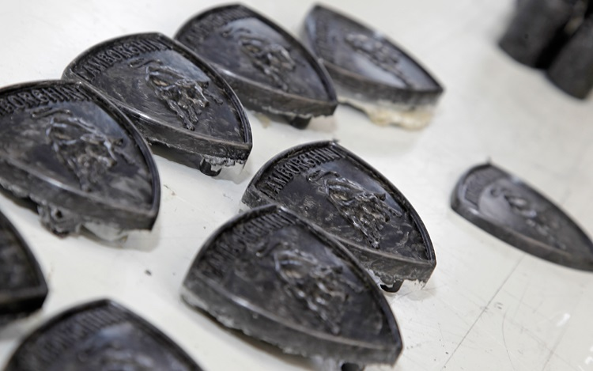
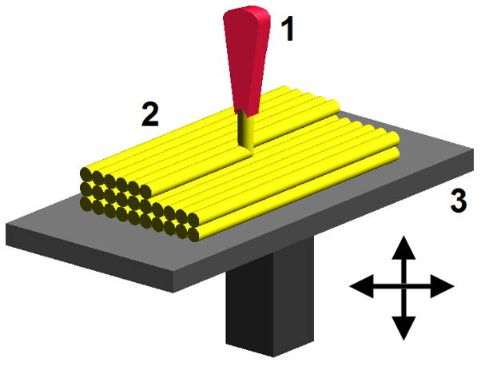
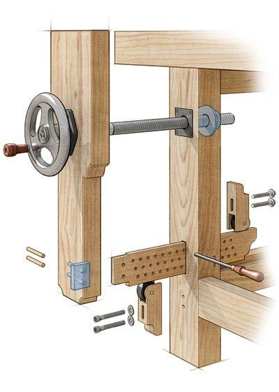
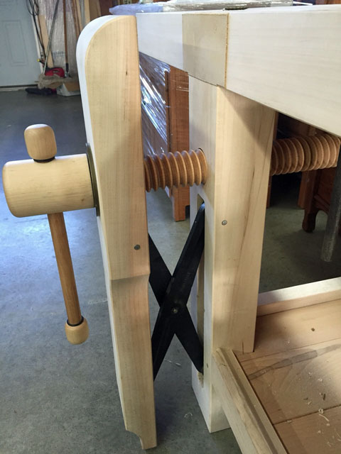

# AE333
## Mechanics of Materials
Lecture 1 - Equilibrium 
Dr. Nicholas Smith 
Wichita State University, Department of Aerospace Engineering

February 1, 2021

----

## schedule

- 1 Feb - Introduction, Equilibrium
- 3 Feb - Stress
- 8 Feb - Strain, Homework 1 Due
- 10 Feb - Mechanical Properties

----

## outline

- introduction
- syllabus
- mechanics
- equilibrium

---

# introduction

----

## about me

 <!-- .element width="30%" -->

----

## education

- B.S. in Mechanical Engineering from Brigham Young University
  - Worked with ATK to develop tab-less gripping system for tensile testing composite tow specimens
  - Needed to align the specimen, as well as grip it without causing a stress concentration

----

## education

- M.S. and Ph.D. from School of Aeronautics and Astronautics at Purdue University
  - Worked with Boeing to simulate mold flows
  - First ever mold simulation with anisotropic viscosity

----

## research

----

## research

----

## research

-  Composites are being used in 3D printing now 
-  Printing patterns are optimized for isotropic materials 
-  Sometimes composites hurt more than they help when not utilized properly 

----

## introductions

- Name
- One interesting thing to remember you by

---

# syllabus and schedule

----

## course textbook

- R.C. Hibbeler - Mechanics of Materials
- This semester I am changing how I do homework, and MasteringEngineering will NOT be used 

----

## office hours

- No traditional office hours this year
- Office appointments can be scheduled via e-mail, although remote meetings are preferred

----

## tentative course outline

-   Section 1 - stress, strain, mechanical properties
  -   Ch 1 - Stress (1 Feb)
  -   Ch 2 - Strain (3 Feb)
  -   Ch 3 - Mechanical Properties (8 Feb)
  -   Exam 1 (15 Feb)
  -   Project 1 (19 Feb)

----

## tentative course outline

-   Section 2 - loading
  -   Ch 4 - Axial Load (17 Feb)
  -   Ch 5 - Torsion (24 Feb)
  -   Ch 6 - Bending (3 Mar)
  -   Ch 7 - Transverse Shear (10 Mar)
  -   Exam 2 (22 Mar)
  -   Project 2 (26 Mar)

----

## tentative course outline

-   Section 3 - beams, shafts, combined loading
  -   Ch 8 - Combined Loading (22 Mar)
  -   Ch 9 - Stress Transformation (29 Mar)
  -   Ch 10 - Strain Transformation (5 Apr)
  -   Ch 12 - Deflection of Beams and Shafts (12 Apr)
  -   Exam 3 (21 Apr)
  -   Project 3 (23 Apr)

----

## tentative course outline

-   Section 4 - buckling, stress concentration
  -   Ch 4.7, 5.8, 6.9 - Stress concentration (26 Apr)
  -   Ch 13 - Buckling (28 Apr)
  -   Final Exam (comprehensive) (10 May)

----

## grades

-   Grade breakdown
  -   Homework 5%
  -   Exam 1 15%
  -   Exam 2 15%
  -   Exam 3 15%
  -   Final Exam 20%

-   Project 1 10%
-   Project 2 10%
-   Project 3 10%

----

## grades

-   Follow a traditional grading scale
-   (80% B-, 83% B, 87% B+, etc.)

----

## curve

-   I do NOT curve final grades
-   Instead, each individual exam is curved on a best-fit linear scale
-   This scale is somewhat subjective, best score is mapped to 100, I
    pick one other score to map that I feel is representative of a C or
    a B
-   The end goal of this curve is to get a standard deviation close to
    10% and a class average representative of the performance on the
    exam, usually between a C and a B

----

## class expectations

-   Consider the cost (to you or others) of your being in class
-   I ask that you refrain from distracting behaviors during class
-   When you have something more important than class to take care of,
    please take care of it outside of class
-   Chegg

----

## homework

-   In general, homework assignments will be due every Friday by midnight
-   Homework will be submitted online via Blackboard, half the homework credit will be granted for completion.
-   Late homework will not be accepted

----

## self-grade 

-   Your homework will be self-graded, your self-grading will generally be due the week after the original assignment
-   Homework solutions will be posted to Blackboard, and the remaining half of the homework credit will be assigned after you complete (and submit) your self-grade.
-   You do not lose credit for incorrect answers, but your self-grade should explain the differences between your answer and the correct solution.
-   Some problems will be somewhat open-ended and there may not be a "correct" answer, so consider that when looking at what is different between your solution and mine

---

# mechanics

----

## mechanics

-   Generally subdivided into three branches
  -   Rigid-body mechanics
  -   Deformable-body mechanics
  -   Fluid mechanics

----

## rigid-body mechanics

-   Statics - bodies in equilibrium (rest or constant velocity)
-   Dynamics - bodies under accelerated motion (`$F=ma$`)

---

# equilibrium of a deformable body

----

## loads

-   Surface loads act on the surface of a body, can be either
    concentrated forces or distributed loads
-   Body forces are developed inside a body, some examples are gravity
    or electromagnetic fields

----

## support reactions

-   In general, if a support prevents translation in a given direction,
    then a reaction force must be developed in that direction
-   Similarly, if a support prevents rotation about an axis, then a
    couple moment must be developed about that axis

----

## equilibrium

	
-   For a body to be in equilibrium the balance of forces and the
    balance of moments must both be zero
`$$\sum F_i =0$$ $$\sum M_i =0$$`

-   For 2D problems, this reduces to
`$$\begin{aligned}
  \sum F_x &= 0\\
  \sum F_y &= 0\\
  \sum M_O &= 0
\end{aligned}$$`

----

## internal resultant loadings

-   We use statics to find resultant loadings acting within a body
-   This is done using the method of sections

----

## internal resultant loadings

-   Normal Force, N - acts perpendicular to an area
-   Shear Force, V - lies in the plane of an area, causes two segments
    to slide over one another
-   Torsional Moment, T - tendency to twist about an axis perpendicular
    to an area
-   Bending Moment, M - tendency to bend the body about an axis lying
    within the plane of the area

----

## planar problems

-   In planar problems, where all forces lie in the same plane, we only
    have
  -   Normal Force
  -   Shear Force
  -   Bending Moment

----

## summary

-   Support reactions
-   Free body diagram
-   Equations of equilibrium

---
# examples

----

## example 1.1

<!-- .element width="70%" -->

Find the internal forces at point C.

<!-- spring 2019 we finished in the middle of this problem-->

----

## example 1.4

![Example 1.4 from the text, depicting an l-shaped shaft with the two legs being 1.25 meters long. If we consider the fixed end of the shaft to be the origin, the shaft proceeds 1.25 meters along the y-axis, then angles 90 degrees to continue 1.25 meters along the x-axis. At the free end, there is a 70 newton-meter couple moment applied about the x-axis, as well as a 50 newton load in the negative z-direction and a 30 newton load in the positive y-direction. Find the internal forces at point d, located 0.75 meters from the fixed end (along the y-axis).](../images/example-1-4.jpg)<!-- .element width="90%" -->

Find the internal forces at point D.

----

## example

Compare three cases for a traditional leg vise for use on Dr. Smith's workbench
- No bottom support
- Standard pin-board
- St. Peter's Cross
- NOTE: Assume the force applied at the vise is the same in all cases (around 2000 lb if you want a number), that the leg vise is 3 ft. tall and the screw is 1 ft. down from the top.

----

## traditional pin-board

 <!-- .element width="30%" -->

----

## St. Peter's Cross

 <!-- .element width="30%" -->
