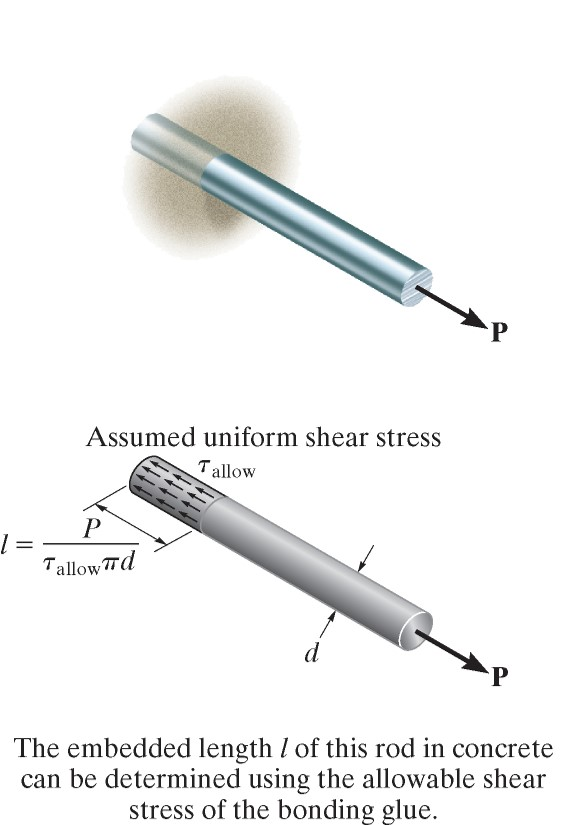
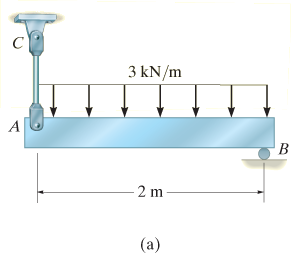

# AE333
## Mechanics of Materials
Lecture 3 - Average Stress 
Dr. Nicholas Smith 
Wichita State University, Department of Aerospace Engineering

January 27, 2020

----

## schedule

- 27 Jan - Average stress, Intro HW Due
- 29 Jan - Assessment Test
- 31 Jan - Allowable stress, Strain
- 3 Feb - Strain, Mechanical Properties

----

## office hours

- Office hours will be TBD
- Send me an e-mail if you have a question and can't make it then
- My office is in WH 200D (inside the main AE offices in Wallace Hall)

----

## outline

  - assessment test
  - stress review
  - average normal stress
  - average shear stress

---

#  assessment test

----
## assessment test

  -   5 (multi-part) problems
  -   Integration of basic functions (polynomials, not trig)
  -   Moment with respect to an axis
  -   Vector addition, particle equilibrium
  -   Distributed loads
  -   Moments of inertia

---
# review

----
## example 1.8

Determine the position, x, of the load so that the average compressive stress at C is equal to the average tensile stress in the rod AB. The rod has an area of `$400\text{ mm}^2$` and the contact at $C$ has an area of `$650\text{ mm}^2$`.

---

# average shear stress

----

## shear stress

-   If we consider a section from a bridge-like structure we can
    demonstrate one way shear stress can be formed in a material
-   As a reminder, shear stress is formed by forces acting in the plane
    of a section cut

----

## shear stress

<!-- .element width="30%" -->

----

## shear stress equilibrium

-   If we consider equilibrium of an element subjected to shear on one
    face, we will find that there must be shear forces on other faces to
    remain in equilibrium
-   In the following example, we will consider the sum of forces in the
    y-direction and the sum of moments about the x-axis
-   We can convert between stresses and forces by recalling that
    `$\sigma = F/A$`, or `$F = \sigma A$`

----

## shear stress equilibrium

<!-- .element width="90%" -->

----

## example 1-9

<!-- .element width="50%" -->

Determine the average shear stress in the 20-mm diameter pin at `$A$` and the 30-mm diameter pin at `$B$`.

----

## example 1-11

Determine the average compressive stress along the smooth contact of `$AB$` and `$BC$` and the average shear stress along the horizontal plane `$DB$`.

---
# allowable stress design

----

## allowable stress

  -   Most of the time, we design structures so the stress is less than
      some limit
  -   By setting a conservative allowable stress, we account for some
      manufacturing tolerances, unintended loads, and variability in
      mechanical properties

----

## factor of safety

  -   The factor of safety is the failure load divided by the allowable
      load
`$$FS = \frac{F_{fail}}{F_{allow}}$$`

  -   Since load and stress are linearly proportional, we could also
      define the factor of safety in terms of stress and it would be
      identical

----

## factor of safety

  -   Typical values for the factor of safety will vary based on
      application

  -   Aircraft and space vehicles might have a factor close to 1 to
      minimize weight

  -   Nuclear power plants might have a factor close to 3 since weight is
      not as important and failure would be catastrophic

----

## simple connections

  -   We can rearrange the equations `$\sigma=N/A$` and `$\tau=V/A$` to size
      components based on some allowable stress

`$$\begin{aligned}
  A &= \frac{N}{\sigma_{allow}}\\
  A &= \frac{V}{\tau_{allow}}
\end{aligned}$$`

----

## bearing stress

  <!-- .element width="40%" -->

----

## embedded shear stress

<!-- .element width="30%" -->

----

## lap joint shear

<!-- .element width="50%" -->

---
# limit state design

----

## limit state design

  -   Allowable stress design accounts for uncertainty in the applied
      loading and the material properties in one factor of safety
  -   Limit state design separates these two into load and resistance
      factors

----

## load factors

  -   The load factor combines uncertainty in various types of load
  -   For example, a building can have loading from a few different
      sources, such as its own weight, people in the building, and snow on
      top of the building
  -   Weight is considered a “dead load” and can usually be determined
      more precisely than moving things like people

----

## load factors

  -   In this simple example, we consider a load factor, `$\gamma_D=1.2$`
      for the dead load, `$\gamma_L=1.6$` and `$\gamma_S=0.5$`
`$$R = 1.2D + 1.6L + 0.5S$$`

  -   These load factors combine the concept of a safety factor with the
      probability that loads will occur

----

## resistance factors

  -   Resistance factors, `$\phi$` are used to express the probability a
      material will fail at its limit load

  -   If we are very confident in the failure stress of a material (i.e.
      steel has little variability), we might use `$\phi=0.9$`

  -   If we are not as confident, (using a new material, or an organic
      material like wood with higher variability), we might use `$\phi=0.7$`

----

## design criteria

  -   If we call the nominal load `$P$`, then we can combine load and
      resistance factors using `$$\phi P \ge R$$`

----

## example 1-12

Determine to the nearest 1/4" the diameters of steel pins at $A$ and $C$ if the factor of safety in shear is 1.5 and the failure shear stress is 12 ksi.

----

## example 1-15

The 400 kg uniform bar, $AB$ is supported by a steel rod $AC$ and a roller at $B$. If it supports a live distributed loading, determine the required diameter of the rod. Use $\sigma_{fail}=345 \text{ MPa}$ with $\phi=0.9$, $\gamma_D=1.2$, and $\gamma_L=1.6$

