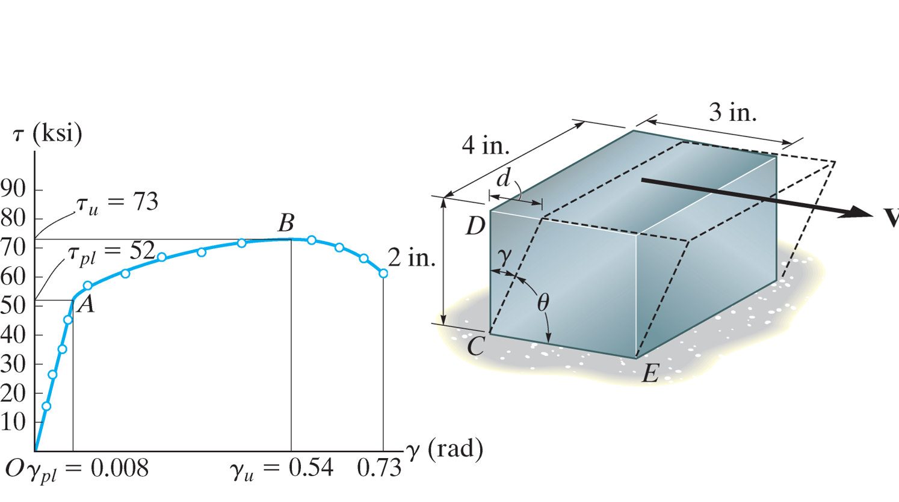

# AE333
## Mechanics of Materials
Lecture 4 - Mechanical Properties 
Dr. Nicholas Smith 
Wichita State University, Department of Aerospace Engineering

27 August, 2020

----

## schedule

- 27 Aug - Mechanical Properties
- 1 Sep - Exam Review, Homework 2 Due
- 3 Sep - Axial Load (not on Exam 1)
- 4 Sep - Project 1 Due
- 8 Sep - Exam 1 (online, no recitation this day)
- 10 Sep - Axial Load

----
## outline

<!-- vim-markdown-toc GFM -->

* stress-strain
* strain energy
* poisson's ratio
* shear stress-strain

<!-- vim-markdown-toc -->

---
# stress-strain

----
## stress-strain

-   Most engineering materials can be characterized by their stress-strain diagram
-   Comes from a tensile or compressive test, where a load is applied (gives stress) and the strain is measured (via an extensometer or strain gauge)
-   *Engineering stress* is plotted on the y-axis vs. *engineering strain* on the x-axis

----
## stress-strain

 <!-- .element width="70%"-->

----
## elastic behavior

-   Most of the time, the linear region is the one we are most interested in
-   In this region, the material is elastic, meaning when the load is removed the material will return to its original state

----
## elastic behavior

-   Because the stress-strain curve is a straight line, we can relate stress and strain with a single constant
-   This constant is known as the *modulus of elasticity* or *Young's modulus*

`$$ \sigma=E \epsilon $$`

----
## plastic behavior

-   Yielding occurs when stress increases beyond the *yield stress* or *elastic limit*, this is when plastic deformation occurs, meaning the material will not go back to its original shape
-   Strain hardening is common in many metals, and means as more stress is applied the material becomes more stiff

----
## plastic behavior

-   Necking occurs when the material begins to have a noticeable "neck" due to being stretched very thin and lower forces are required to deform the material

----
## true stress-strain

-   True stress and strain use the actual material cross-section (instead of the original cross-section) to calculate stress and strain
-   In the elastic region the difference is negligible, so in many cases we just stick with engineering strain, even if we know it is *wrong*

----
## ductile materials

-   Ductile materials can undergo large strains before failure
-   One way to report how ductile a material is is known as percent elongation
-   Steel, brass, molybdenum, and zinc exhibit similar ductile stress-strain characteristics
-   Aluminum is often considered ductile, but its stress-strain behavior is a bit different

----
## brittle materials

-   Materials that exhibit little or no yielding before failure are called *brittle*
-   Cast iron, concrete, and glass are common brittle materials
-   Brittle materials fail easily in tension, but are very strong in compression

----
## strain hardening

 <!-- .element width="40%"-->

---
# strain energy

----
## strain energy

-   Work in physics is defined as force times distance
-   As a force is applied to a material, the energy from the work done by the load is stored in the material and called strain energy
-   In engineering, we often use the strain energy density, or the amount of strain energy per unit volume of material

$$u = \\frac{1}{2} \\sigma \\epsilon$$

----
## toughness

-   Graphically, the area under the stress strain curve represents the strain energy density
-   We call the entire region (usually for a ductile material) the *toughness*
-   Some hardened steels have a high failure strength, but are not very ductile, this gives them a lower toughness

----
## example 3.3

The aluminum rod shown has a circular cross-section. Determine the elongation of the rod when load is applied using the given stress-strain diagram.

---
# poisson's ratio

----
## poisson's ratio

-   When a material is stretched in one direction, it tends to contract in the transverse direction
-   The ratio of transverse to axial strain is called *Poisson's ratio*

$$\\nu = - \\frac{\\epsilon\_{transverse}}{\\epsilon\_{axial}}$$

---
# shear stress-strain

----
## shear stress-strain

-   It can be experimentally difficult to obtain a state of pure shear, but a common method for many materials is to place a thin tube in torsion
-   For most engineering materials, the shear stress-strain behavior is linear in the elastic region, but has a different constant relating stress to strain, known as the *Shear Modulus*

$$\tau=G \gamma $$

----
## elastic constants

-   For most materials, *E*, *G* and `$\nu$` are related by the following expression

$$G = \\frac{E}{2(1+\\nu)}$$

----
## example 3.5

Determine G for the specimen shown. Also find the maximum distance d, that the top could be displaced horizontally while remaining elastic. What force V is required to cause this displacement?

