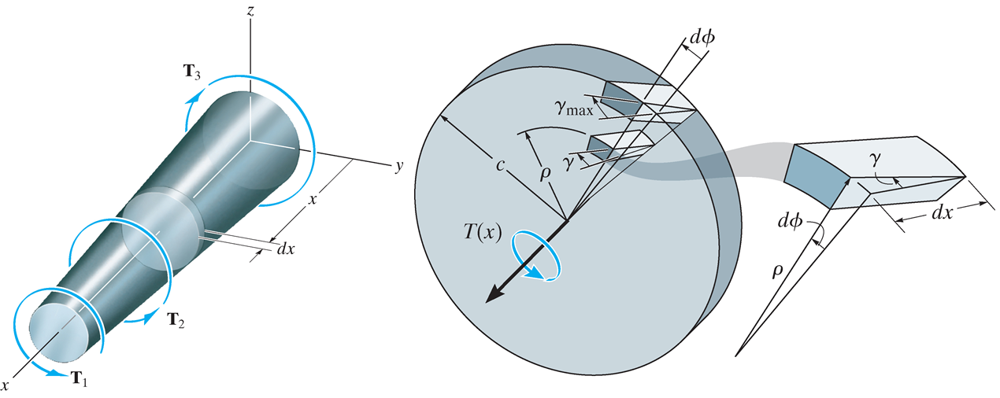
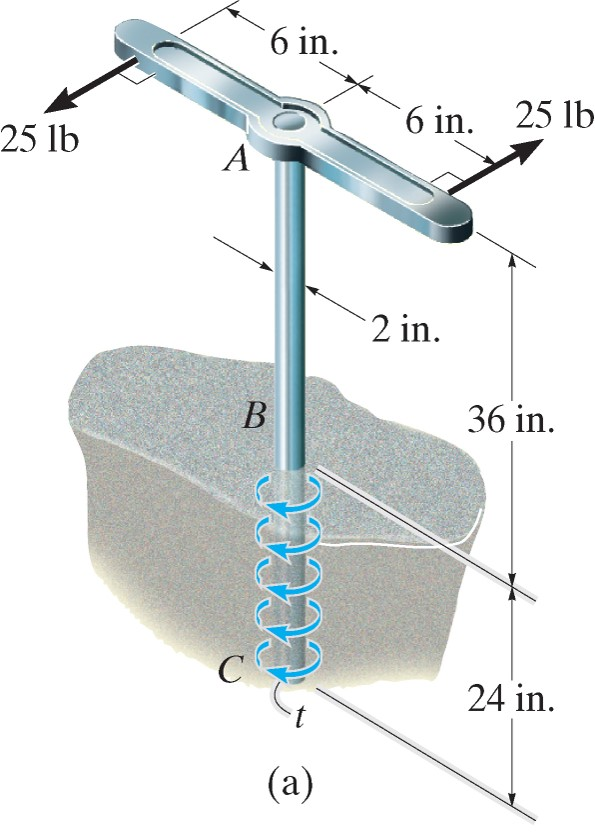
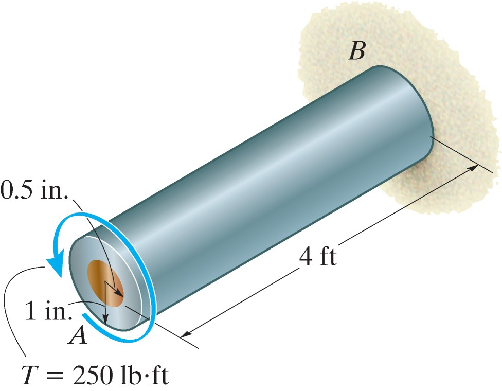

## AE333
## Mechanics of Materials
Lecture 10 - Torsion 
Dr. Nicholas Smith 
Wichita State University, Department of Aerospace Engineering

20 September, 2021

----
## schedule

- 20 Sep - Torsion
- 22 Sep - Bending
- 24 Sep - Homework 3 Due
- 27 Sep - Bending
- 29 Sep - Transverse Shear
- 1 Oct - Homework 4 Due, Homework 3 Self-grade due

----
## outline

<!-- TOC START min:1 max:1 link:false update:true -->
- angle of twist
- statically indeterminate torsion
- solid non-circular shafts
- thin-walled tubes

<!-- TOC END -->

---
# angle of twist

----
## angle of twist

-   While in axial problems we examined the total deformation for the general case, in torsion we will examine the total angle of twist in general
-   Using the method of sections, we can consider a differential disk which has some internal torque as a function of *x*, *T*(*x*).
-   On this section, the shear strain will be related to the angle of twist by the thickness of the section (*dx*) and the radial distance ($\rho$).

----
## angle of twist

----
## angle of twist

-   `$\gamma$` and `$d\phi$` are related by

`$$d\phi = \gamma \frac{dx}{\rho}$$`

-   We also know that `$\gamma = \tau/G$` and `$\tau = T(x) \rho / J(x)$` substituting both this gives

`$$d\phi = \frac{T(x)}{J(x)G(x)}dx$$`

----
## multiple torques

-   If a shaft is subjected to multiple torques, or if there is a discontinuous change in shape or material we can sum the change in angle over various segments

`$$\phi = \sum \frac{TL}{JG}$$`

----
## sign convention

-   When we section a shaft and consider the internal torque, it is important to be consistent with our signs
-   Both torque and angle of twist should follow the same convention
-   The convention is to use the right hand rule with the thumb pointing normal to the cut, and the fingers curling in the positive direction

----
## example 5.8

Find the maximum shear stress in the post and the angle of twist of the wrench.The torque is about to turn the bottom of the post, the soil exerts uniform torsional resistance of *t* lb.in/in and G=5.5 Msi.

---
# statically indeterminate torsion

----
## statically indeterminate torsion

-   Just as in axial problems, we can now solve statically indeterminate torsion problems
-   We will generally need one compatibility condition in addition to the equations of static equilibrium
-   At any given section cut the angle of twist needs to be equal, or often the supports restrict the angle of twist and we can use that knowledge

----
## example 5.10

The shaft shown is made from a steel tube bonded to a brass core. Plot the shear stress distribution along a radial line on its cross-section where `$G_{ST}=11.4$` Msi and `$G_{BR}=5.20$` Msi.  

---
# solid non-circular shafts

----
## non-circular shafts

-   When a shaft is non-circular it is no longer axisymmetric, which causes cross-sections to bulge or warp
-   Because of this deformation, in-depth analysis of non-circular shafts in torsion is beyond the scope of this class
-   Using the theory of elasticity some standard shapes can be analyzed

----
## theory of elasticity

 <!-- .element width="40%" -->

---
# thin-walled tubes

----
## shear flow

-   Thin-walled tubes of non-circular cross-sections are commonly found in aerospace and other applications
-   We can analyze these using a technique called shear flow
-   Because the walls of the tube are thin, we assume that the shear stress is uniformly distributed through the wall thickness

----
## shear flow

-   If we consider an arbitrary segment of a tube with varying thickness, we find from equilibrium that the product of the average shear stress and the thickness must be the same at every location on the cross-section

`$$q = \tau_{avg} t$$`

-   *q* is called the shear flow

----
## average shear stress

-   We can relate the average shear stress to the torque by considering the torque produced about some point within the tubes boundary

`$$T = \oint h \tau_{avg} t ds$$`

-   Where *h* is the distance from the reference point, *ds* is the differential arc length and *t* is the tube thickness.

----
## average shear stress

-   We notice that `$\tau_{avg}t$` is equal to the shear flow, *q*, which must be constant
-   We can also simplify the integral by relating a similar area integral to the arc length integral

`$$dA_m = 1/2 h ds$$`

-   Thus

`$$T = \oint h\tau_{avg} t ds = 2 q \int dA_m = 2 q A_m$$`

----
## angle of twist

- The angle of twist for a thin-walled tube is given by

`$$ \phi = \frac{TL}{4A_m^2 G} \oint \frac{ds}{t} $$`

----
## example 5.13

 <!-- .element width="60%" -->

Determine the average shear stress at A and B.
