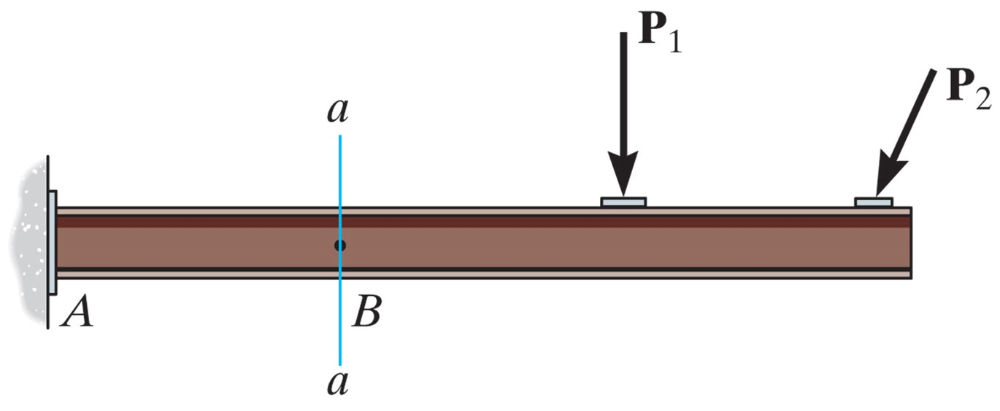
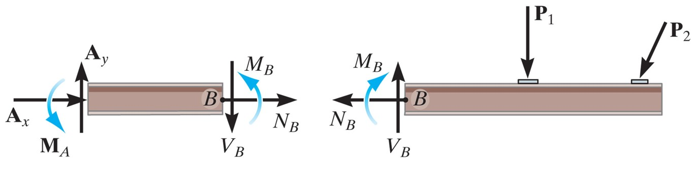
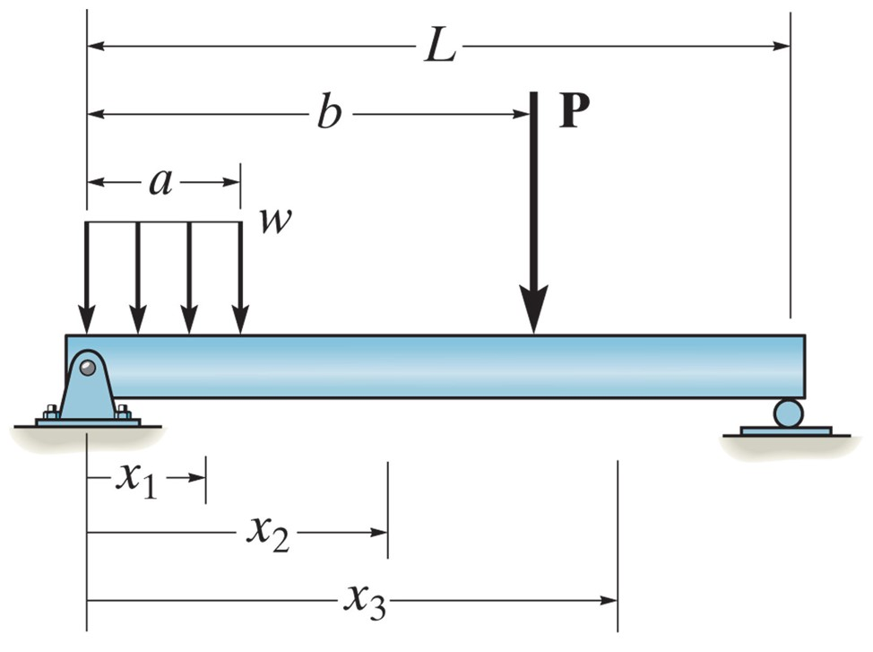
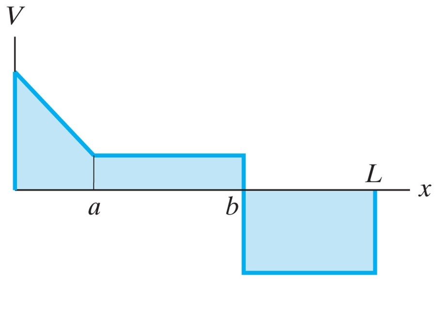
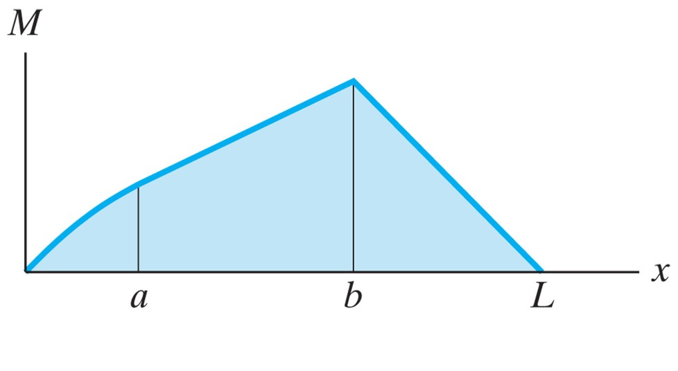
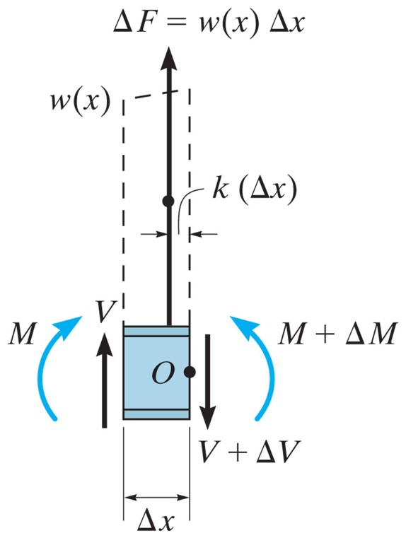
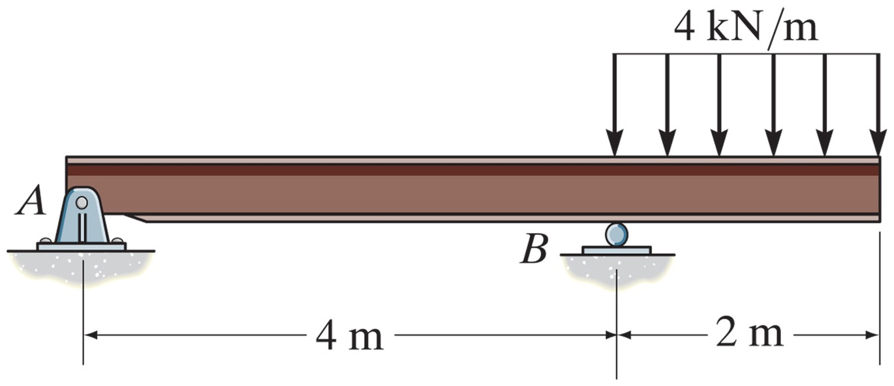
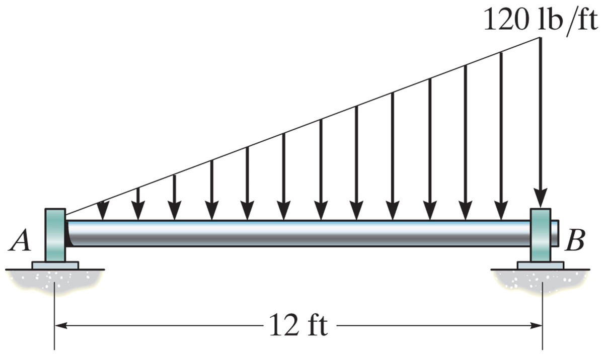
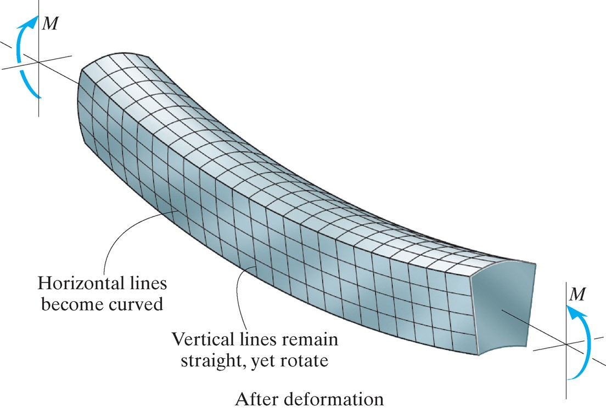
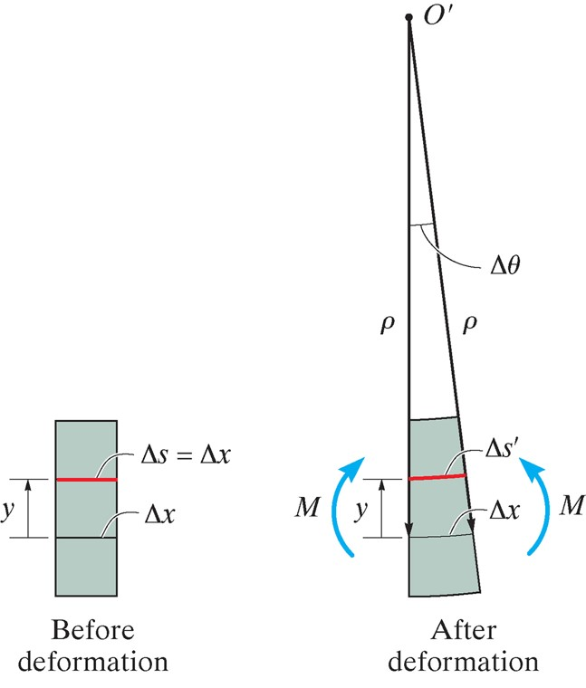

## AE333
## Mechanics of Materials
Lecture 11 - Bending 
Dr. Nicholas Smith 
Wichita State University, Department of Aerospace Engineering

22 September, 2021

----
## schedule

- 22 Sep - Bending
- 24 Sep - Homework 3 Due
- 27 Sep - Bending
- 29 Sep - Transverse Shear
- 1 Oct - Homework 4 Due, Homework 3 Self-grade due
- 4 Oct - Transverse Shear

----
## outline

<!-- vim-markdown-toc GFM -->

* shear and moment diagrams
* graphical method
* bending deformation

<!-- vim-markdown-toc -->

---
# shear and moment diagrams

----
## shear and moment diagrams

-   The general approach to shear and moment diagrams is to first find the support reactions
-   Next we section the beam and instead of finding the internal force and moment at a single point, we find it as a function of *x*
-   Many beams will require piecewise sectioning
-   We then draw this as a shear and moment diagram

----
## sign convention

 <!-- .element width="60%" -->

 <!-- .element width="60%" -->

----
## example beam

 <!-- .element width="60%" -->

----
## example beam

 <!-- .element width="60%" -->

----
## example beam

 <!-- .element width="60%" -->

---
# graphical method

----
## relation between load, shear, moment

-   When there are several forces, supports, or loading conditions applied to a beam, the piecewise method can be cumbersome
-   In this section we will examine the differential relationships between distributed load, shear, and bending moments

----
## distributed load

 <!-- .element width="40%" -->

----
## distributed load

-   Consider a beam subjected to only distributed loading
-   If we section this beam in the middle (to remove both supports) we can relate *V* to the loading function *w*(*x*)
-   Considering the sum of forces in *y*:

`$$\begin{aligned}
  V + w(x)\Delta x - (V + \Delta V) &= 0\\\\
  \Delta V &= w(x) \Delta x
\end{aligned}$$`

----
## distributed load

-   If we divide by `$\Delta x$` and let `$\Delta x \to 0$` we find

`$$\frac{dV}{dx} = w(x)$$`

-   Thus the slope of the shear diagram is equal to the distributed load function

----
## moment diagram

-   If we consider the sum of moments about *O* on the same section we find

`$$\begin{aligned}
  (M + \Delta M) - (w(x)\Delta x)k \Delta x - V\Delta x - M &= 0\\\\
  \Delta M &= V \Delta x + k w(x) \Delta x ^2
\end{aligned}$$`

-   Dividing by `$\Delta x$` and letting `$\Delta x \to 0$` gives

`$$\frac{dM}{dx} = V$$`

----
## concentrated forces

-   If we consider a concentrated force (instead of a distributed load) we find

`$$\Delta V = F $$`

-   This means that concentrated loads will cause the shear diagram to "jump" by the amount of the concentrated force (causing a discontinuity on our graph)

----
## couple moments

-   If our section includes a couple moment, we find (from the moment equation) that

`$$\Delta M = M_0 $$`

-   Thus the moment diagram will have a jump discontinuity

----
## example 7.9

----
## example 7.10

 <!-- .element width="60%" -->

---
# bending deformation

----
## bending deformation

-   If we drew a grid on a specimen in bending, we would find that vertical lines tend to stay straight (but rotate)
-   Horizontal lines will become curved
-   If bending lifts the ends up (like a smile), then the top face will be in compression (and expand), while the bottom face will be in tension (and contract)

----
## bending deformation

 <!-- .element width="60%" -->

----
## neutral axis

-   Since the bottom is in tension and the top is in compression, there must be somewhere in between that is under no stress
-   We call that the neutral axis, and assume it does not change in length
-   We also assume that planar sections remain planar (no warping)
-   Finally, Poisson's effects are neglected (cross-sections keep the same size and shape)

----
## strain

-   We will now consider an infinitesimal beam element before and after deformation
-   `$\Delta x$` is located on the neutral axis and thus does not change in length after deformation
-   Some other line segment, `$\Delta s$` is located *y* away from the neutral axis and changes its length to `$\Delta s ^\prime$` after deformation

----
## strain

 <!-- .element width="40%" -->

----
## strain

-   We can now define strain at the line segment `$\Delta s$` as

`$$\epsilon = \lim_{\Delta s \to 0} \frac{\Delta s^\prime - \Delta s}{\Delta s}$$`

----
## strain

-   If we define `$\rho$` as the radius of curvature after deformation, thus `$\Delta x = \Delta s = \rho \Delta \theta$`
-   The radius of curvature at `$\Delta s$` is `$\rho - y$`, thus we can write

`$$\epsilon = \lim_{\Delta \theta \to 0} \frac{(\rho-y)\Delta \theta - \rho \Delta \theta}{\rho \Delta \theta}$$`

-   Which gives

`$$\epsilon = -\frac{y}{\rho}$$`

