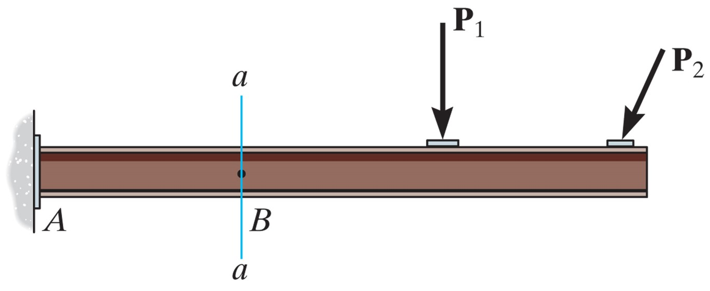
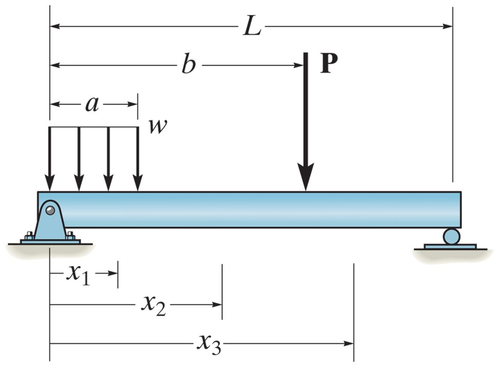
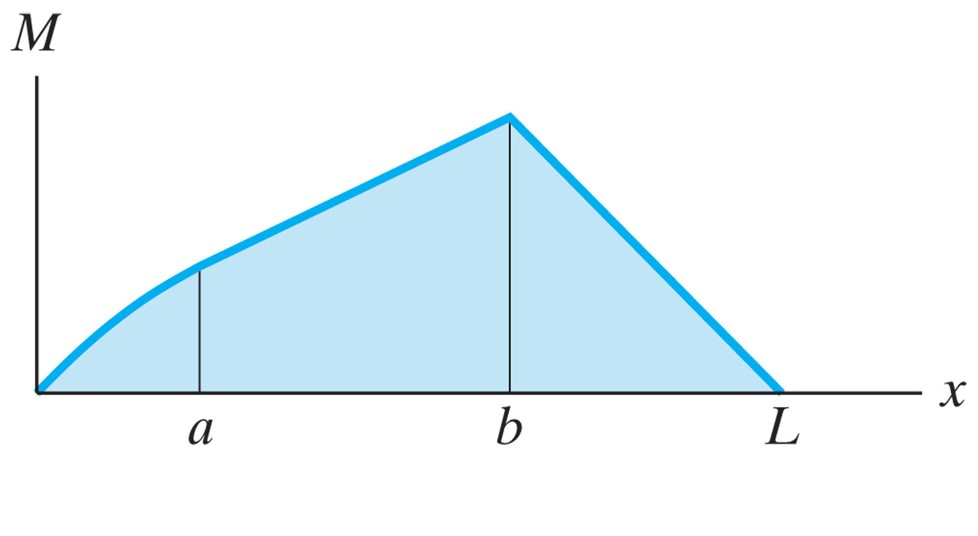
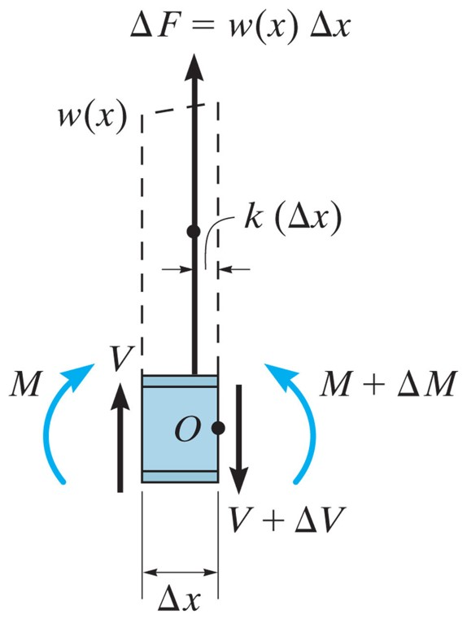
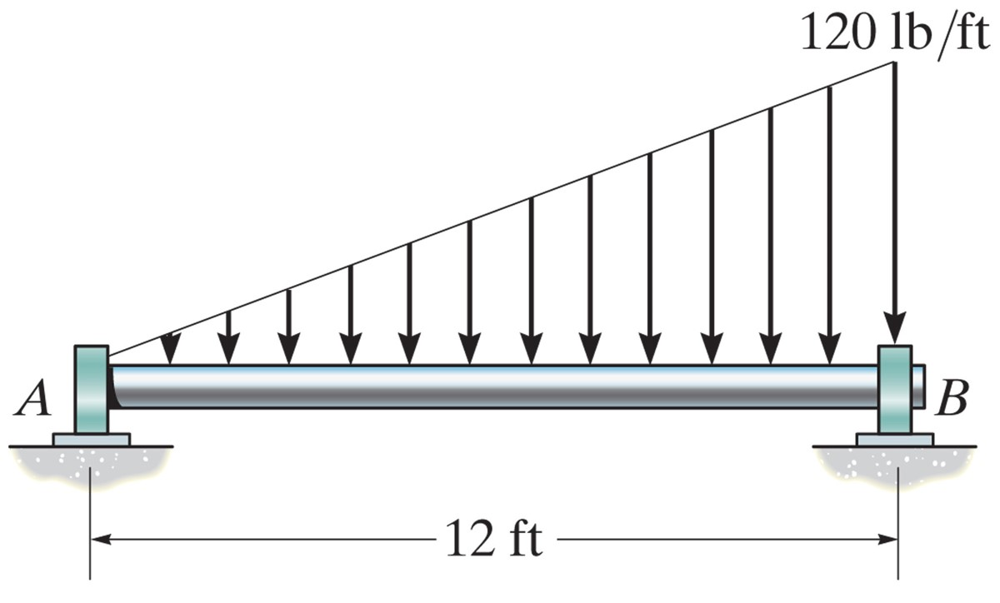

## AE333
## Mechanics of Materials
Lecture 13 - Bending 
Dr. Nicholas Smith 
Wichita State University, Department of Aerospace Engineering

February 28, 2020

----
## schedule

- 28 Feb - Bending, HW4 Due
- 2 Mar - Bending
- 4 Mar - Bending
- 6 Mar - Transverse Shear, HW 5 Due

----
## outline

<!-- TOC START min:1 max:1 link:false update:true -->
- thin-walled tubes
- shear and moment diagrams
- graphical method

<!-- TOC END -->

----
## shear-moment diagrams

- Drawing shear-moment diagrams is a very important skill
- Learning MasteringEngineering's drawing system is not as important (in my opinion)
- If you are more comfortable doing your shear-moment diagrams by hand, you may turn them into me in class on Friday and I will grade them by hand

---
# thin-walled tubes

----
## shear flow

-   Thin-walled tubes of non-circular cross-sections are commonly found in aerospace and other applications
-   We can analyze these using a technique called shear flow
-   Because the walls of the tube are thin, we assume that the shear stress is uniformly distributed through the wall thickness

----
## shear flow

-   If we consider an arbitrary segment of a tube with varying thickness, we find from equilibrium that the product of the average shear stress and the thickness must be the same at every location on the cross-section

$$q = \tau_{avg} t$$

-   *q* is called the shear flow

----
## average shear stress

-   We can relate the average shear stress to the torque by considering the torque produced about some point within the tubes boundary

`$$T = \oint h \tau_{avg} t ds$$`

-   Where *h* is the distance from the reference point, *ds* is the differential arc length and *t* is the tube thickness.

----
## average shear stress

-   We notice that `$\tau_{avg}t$` is equal to the shear flow, *q*, which must be constant
-   We can also simplify the integral by relating a similar area integral to the arc length integral

$$dA_m = 1/2 h ds$$

-   Thus

$$T = \oint h\tau_{avg} t ds = 2 q \int dA_m = 2 q A_m$$

----
## example 5.13

 <!-- .element width="60%" -->

Determine the average shear stress at A and B.

---
# shear and moment diagrams

----
## shear and moment diagrams

-   The general approach to shear and moment diagrams is to first find the support reactions
-   Next we section the beam and instead of finding the internal force and moment at a single point, we find it as a function of *x*
-   Many beams will require piecewise sectioning
-   We then draw this as a shear and moment diagram

----
## sign convention

 <!-- .element width="60%" -->

 <!-- .element width="60%" -->

----
## example beam

 <!-- .element width="60%" -->

----
## example beam

 <!-- .element width="60%" -->

----
## example beam

 <!-- .element width="60%" -->

---
# graphical method

----
## relation between load, shear, moment

-   When there are several forces, supports, or loading conditions applied to a beam, the piecewise method can be cumbersome
-   In this section we will examine the differential relationships between distributed load, shear, and bending moments

----
## distributed load

 <!-- .element width="40%" -->

----
## distributed load

-   Consider a beam subjected to only distributed loading
-   If we section this beam in the middle (to remove both supports) we can relate *V* to the loading function *w*(*x*)
-   Considering the sum of forces in *y*:

$$\\begin{aligned}
  V + w(x)\\Delta x - (V + \\Delta V) &= 0\\\\
  \\Delta V &= w(x) \\Delta x
\\end{aligned}$$

----
## distributed load

-   If we divide by $\Delta x$ and let $\Delta x \to 0$ we find

$$\\frac{dV}{dx} = w(x)$$

-   Thus the slope of the shear diagram is equal to the distributed load function

----
## moment diagram

-   If we consider the sum of moments about *O* on the same section we find

$$\\begin{aligned}
  (M + \\Delta M) - (w(x)\\Delta x)k \\Delta x - V\\Delta x - M &= 0\\\\
  \\Delta M &= V \\Delta x + k w(x) \\Delta x ^2
\\end{aligned}$$

-   Dividing by $\Delta x$ and letting $\Delta x \to 0$ gives

$$\\frac{dM}{dx} = V$$

----
## concentrated forces

-   If we consider a concentrated force (instead of a distributed load) we find

$$\Delta V = F $$

-   This means that concentrated loads will cause the shear diagram to "jump" by the amount of the concentrated force (causing a discontinuity on our graph)

----
## couple moments

-   If our section includes a couple moment, we find (from the moment equation) that

$$\Delta M = M_0 $$

-   Thus the moment diagram will have a jump discontinuity

----
## example 7.9

----
## example 7.10

 <!-- .element width="60%" -->
