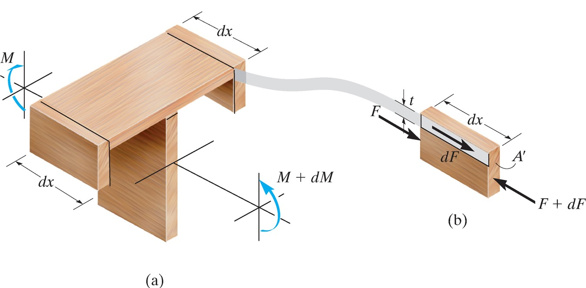
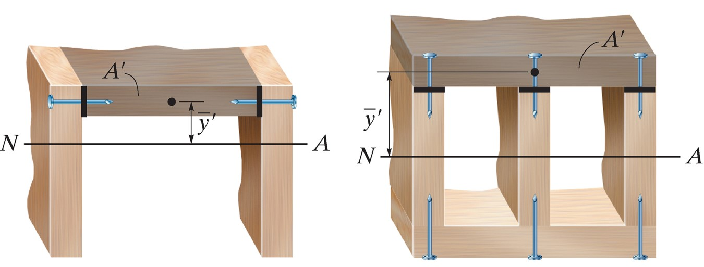
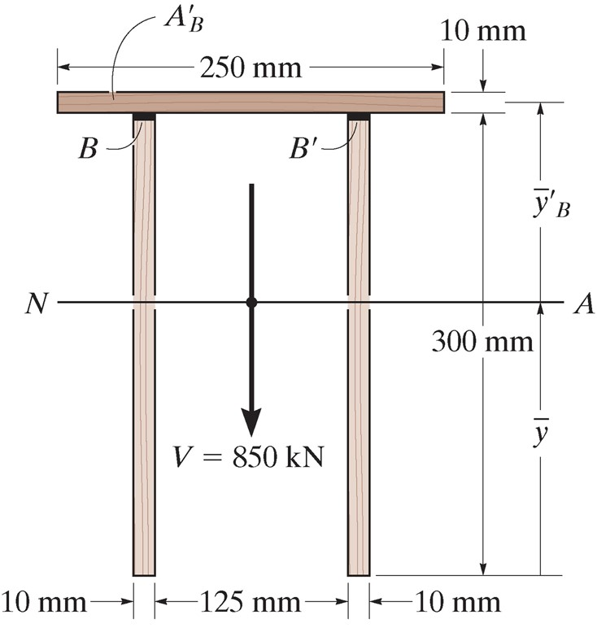
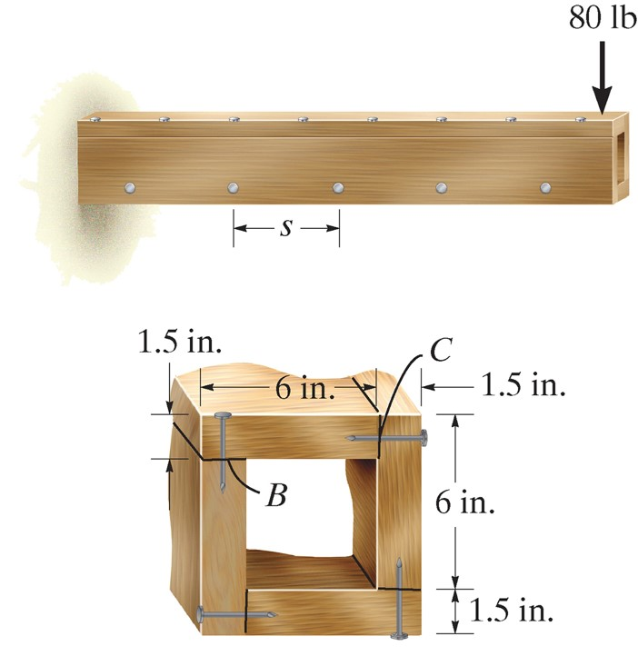
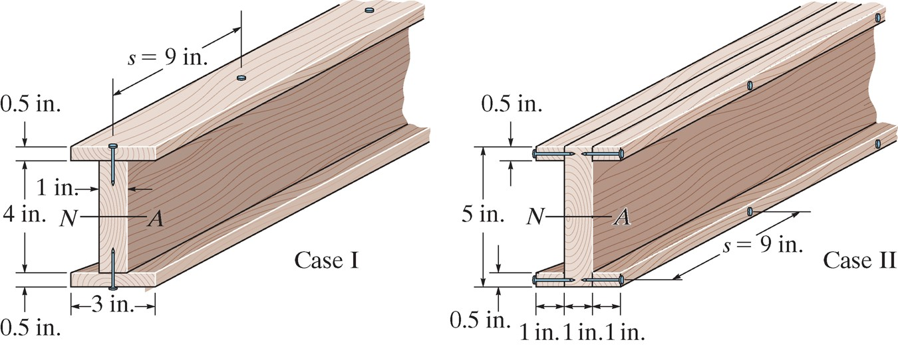

## AE333
## Mechanics of Materials
Lecture 14 - Transverse Shear 
Dr. Nicholas Smith 
Wichita State University, Department of Aerospace Engineering

24 March, 2021

----
## schedule

- 24 Mar - Transverse Shear
- 29 Mar - Exam 2 Review
- 29 Mar - Homework 6 Due, Homework 5 Self-grade due
- 31 Mar - Exam 2

----
## outline

<!-- vim-markdown-toc GFM -->

* shear flow in built-up members

<!-- vim-markdown-toc -->

---
# shear flow in built-up members

----
## built-up members

-   Often in practice, structural members are "built-up"
-   This refers to parts that are comprised of several other parts to have greater strength in certain areas
-   We need to analyze the shear between these members to choose appropriate adhesives or fasteners

----
## equilibrium

----
## equilibrium

-   From equilibrium we see that

`$$dF = \frac{dM}{I} \int_{A^\prime} y dA^\prime$$`

-   We recall that this integral represents *Q*, we can also define the shear flow as `$q=dF/dx$`and recall that `$dM/dx=V$` to find

`$$q = \frac{VQ}{I}$$`

----
## fastener spacing

-   We can use shear flow to determine fastener spacing
-   Say a fastener can support a shear force of `$F_0$` before failure
-   The shear flow (force/distance) times the spacing (distance) will give the shear force per fastener

`$F=qs$`

----
## multiple fasteners

----
## multiple fasteners

-   When multiple arms are connecting the same area (as shown in the previous slide)
-   The shear flow "seen" by each fastener is *q*/*n* where *n* is the number of fasteners per area

----
## example 7.4

 <!-- .element width="30%" -->

Determine the shear flow at B and B' that must be resisted by glue to bond the boards together.

----
## example 7.5

If each nail can support a maximum shear force of 30 lb, determine the maximum spacing of the nails at B and at C so that the beam can support the force of 80 lb.

----
## example 7.6

 <!-- .element width="50%" -->

Nails with a shear strength of 40 lb are used in a beam that can be constructed as shown in Case I or Case II. If the nails are spaced at 9 in determine the largest vertical shear that can be supported.

