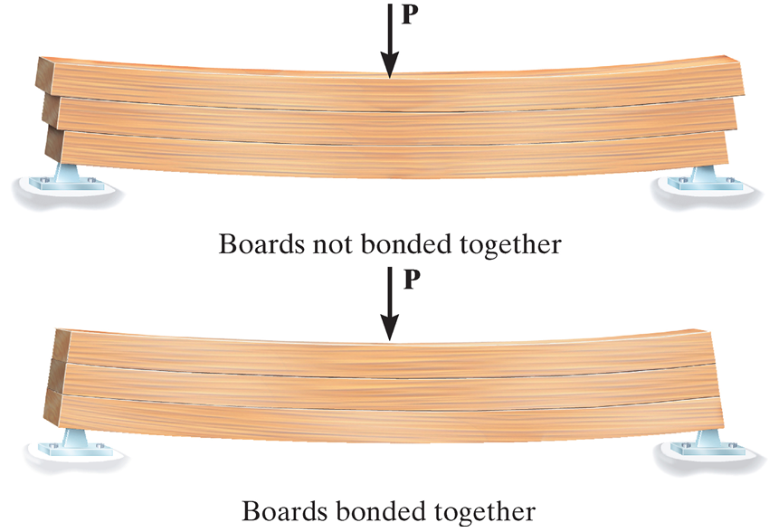
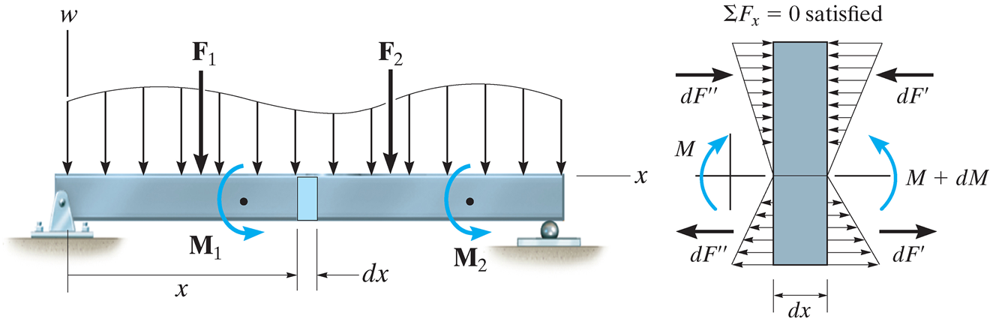
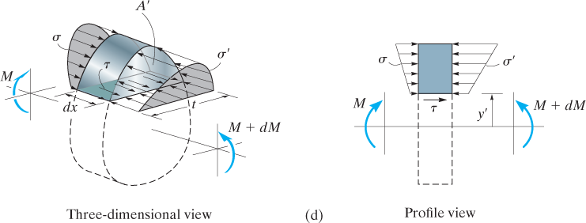
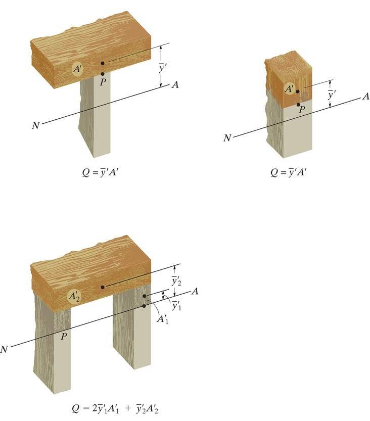
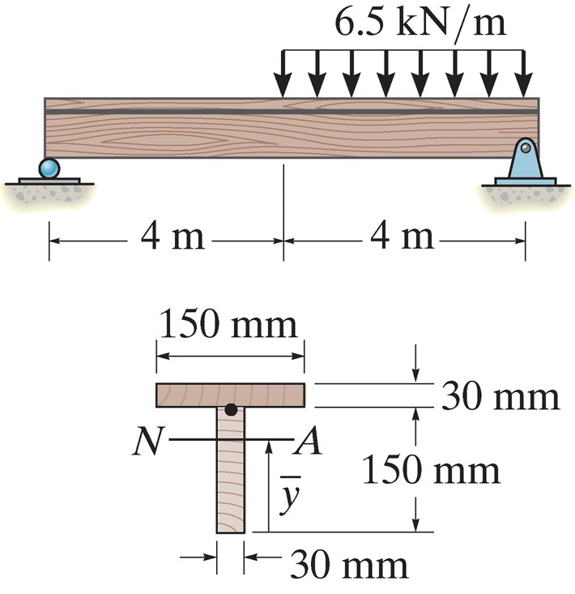
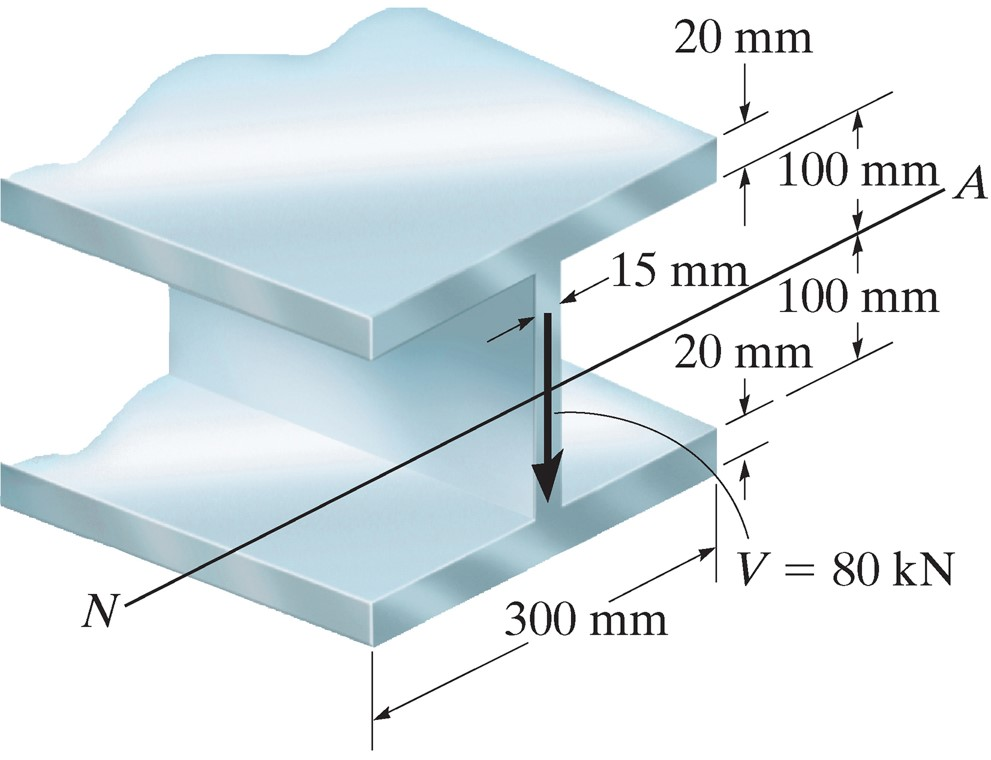
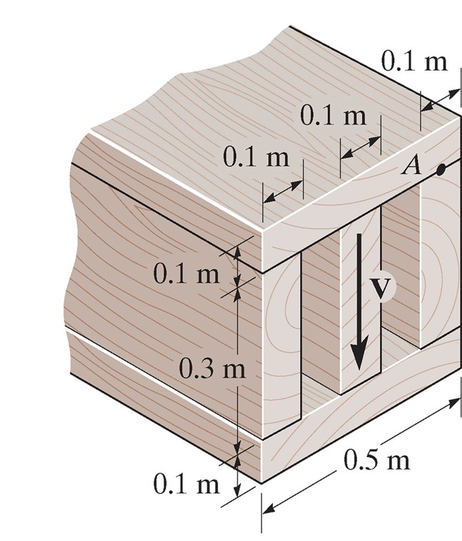
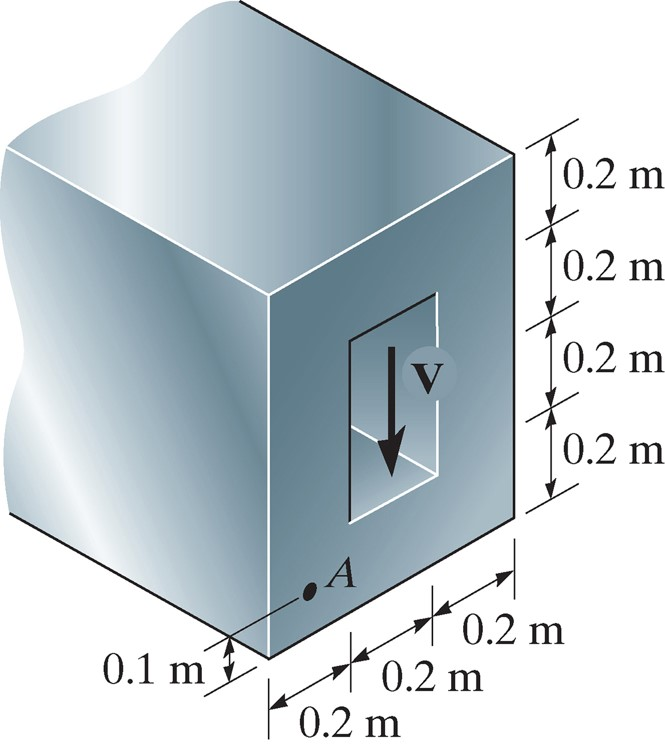
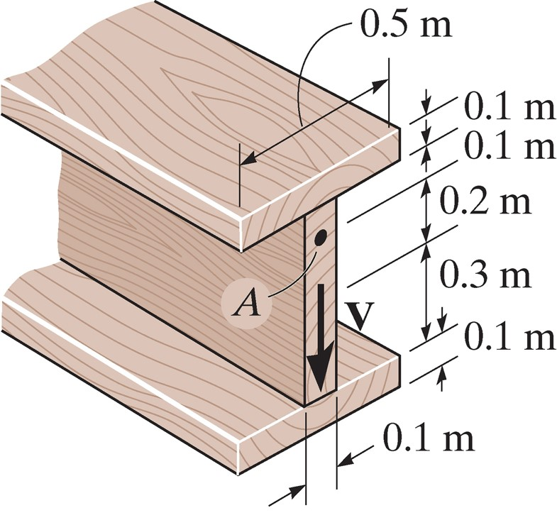

## AE333
## Mechanics of Materials
Lecture 13 - Transverse Shear 
Dr. Nicholas Smith 
Wichita State University, Department of Aerospace Engineering

29 September, 2020

----
## schedule

- 29 Sep - Transverse Shear, Homework 5 Due, Homework 4 Self-Grade Due
- 1 Oct - Transverse Shear
- 6 Oct - Exam review, Homework 6 Due, Homework 5 Self-Grade Due
- 8 Oct - Exam 2

----
## outline

<!-- vim-markdown-toc GFM -->

* shear in straight members
* the shear formula
* group problems

<!-- vim-markdown-toc -->

---
# shear in straight members

----
## shear

-   We have discussed the internal stresses caused by the internal moment *M*
-   There are also internal shear stresses caused by the internal shear force *V*
-   We can illustrate the effect of internal shear stress by considering three boards, either resting on top of on another or bonded

----
## shear

 <!-- .element width="60%" -->

---
# the shear formula

----
## shear formula

-   Internal shear causes a more complicated deformation state, so we will use an indirect method to find the shear stress-strain distribution
-   We will consider equilibrium along a section of a beam, then we will consider another section

----
## equilibrium

----
## equilibrium

 <!-- .element width="50%" -->

----
## equilibrium

-   There must be a shear force along the bottom to equilibrate the different stresses on either side of the section
-   If we assume that this shear is constant through the thickness, we obtain the following from equilibrium

`$$\sum F_x = 0 = \int_{A^\prime} \sigma^\prime dA^\prime - \int_{A^\prime} \sigma dA^\prime - \tau (t dx)$$`

----
## equilibrium

$$\\small{\\begin{aligned}
  0 &= \\int\_{A^\\prime} \\left( \\frac{M + dM}{I} \\right) y dA^\\prime - \\int\_{A^\\prime} \\left( \\frac{M}{I} \\right)y dA^\\prime - \\tau(t dx) \\\\
  \\left( \\frac{dM}{I} \\right) \\int\_{A^\\prime} y dA^\\prime &= \\tau (t dx)\\\\
  \\tau &= \\frac{1}{It} \\left( \\frac{dM}{dx} \\right)\\int\_{A^\\prime} y dA^\\prime
\\end{aligned}}$$

----
## shear formula

-   In this formula, recall that $V = \\frac{dM}{dx}$
-   We also call *Q* the moment of the area `$A^\prime$` which is equal to `$\int_{a^\prime} y dA^\prime$`
-   We can also write *Q* in terms of the centroid

$$Q = \\bar{y}^\\prime A^\\prime$$

----
## shear formula

-   Simplified, the shear formula is

$$\\tau = \\frac{VQ}{It}$$

-   *Q* poses the greatest difficulty in calculations, so we will consider a few examples

----
## Q

-   *Q* represents the moment of the cross-sectional area above (or below) the point at which the shear stress is being calculated
-   We apply the formula to that area

----
## Q

 <!-- .element width="35%" -->

----
## shear formula limitations

-   A major assumption made is that the shear stress was constant through the thickness, essentially we have found the average shear
-   This is more accurate the more slender a beam is (small *b* and large *h*)
-   The formula is also not accurate for cross sections that change or have boundaries that are not right angles

----
## procedure

-   First we find the internal shear, *V*
-   Find *I*, the moment of inertia (of the entire section) about the neutral axis
-   Find *t* from an imaginary cross-section at the point of interest
-   Calculate *Q* from either the area above or below the point of interest
-   $\tau$ acts in the same direction as *V* (and must be equilibrated on other faces)

----
## example 7.1

 <!-- .element width="35%" -->

Determine the maximum stress needed by a glue to hold the boards together.

----
## example 7.3

 <!-- .element width="50%" -->

Plot the shear stress distribution through the beam.

---
# group problems

----
## group one

 <!-- .element width="30%" -->

Find Q and t that would be used to find the shear stress at A.

----
## group two

 <!-- .element width="30%" -->

Find Q and t that would be used to find the shear stress at A.

----
## group three

 <!-- .element width="30%" -->

Find Q and t that would be used to find the shear stress at A.

