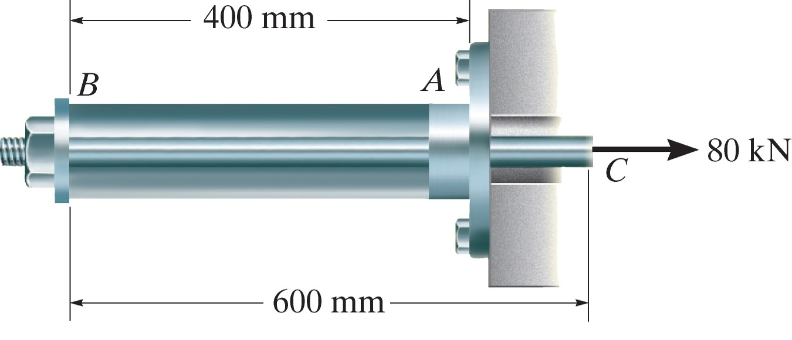
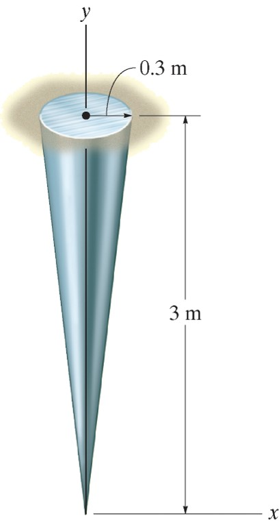
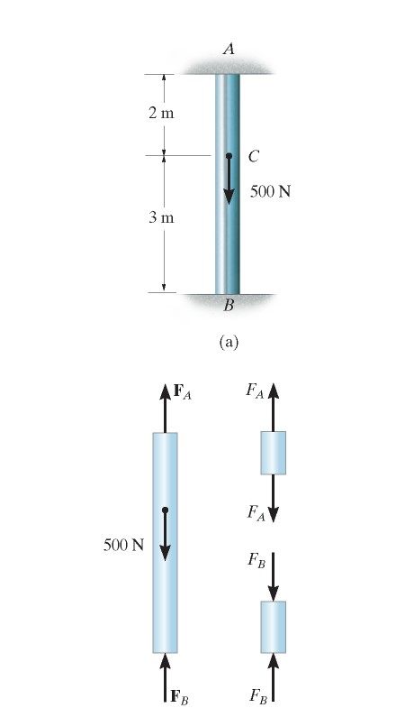
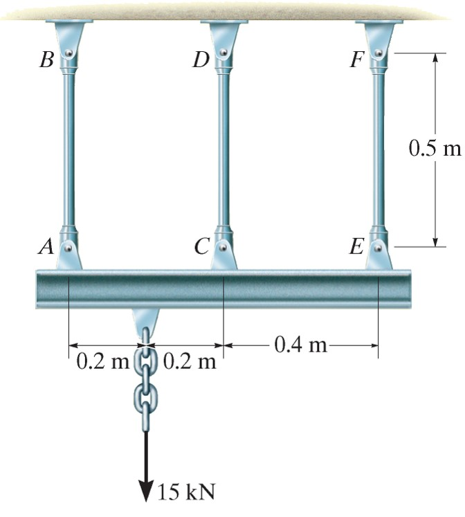

# AE333
## Mechanics of Materials
Lecture 5 - Axial Load 
Dr. Nicholas Smith 
Wichita State University, Department of Aerospace Engineering

February 15, 2021

----
## schedule

- 15 Feb - Axial Load (not on exam 1)
- 17 Feb - Exam Review
- 19 Feb - Homework 2 Due, Homework 1 Self-grade Due
- 22 Feb - Exam 1
- 26 Feb - Project 1 Due

----
## outline

- saint venant's principle
- elastic axial deformation
- superposition
- statically indeterminate

---
# saint venant's principle

----
## saint venant's principle

-   We use Saint Venant's principle to generalize various loading applications
-   If we apply a concentrated force, near where we apply it (for example, along a pin), the stress will not be very uniform
-   Far away from that point, however, the stress will be uniform, whether we apply the force with 1 pin, 2 pins, or via a uniform grip

----
## saint venant's principle

-   We use *saint venant's principle* to replace difficult to model loads with easier ones
-   There are two conditions
    1.  The load must be statically equivalent
    2.  Our region of interest must be far enough away from the point where the load was applied

----
## saint venant's principle

---
# elastic axial deformation

----
## axially loaded member

-   We can use Hooke's Law to find the deformation of a general body under axial loading (below the elastic limit)

----
## axially loaded member

-   For some differential element, we can consider the internal forces and stresses

`$$\sigma = \frac{N(x)}{A(x)} = E(x) \epsilon(x) = E(x) \left(\frac{d\delta}{dx}\right)$$`

-   We can solve this for `$d\delta$` to find

`$$d \delta = \frac{N(x) dx}{A(x)E(x)}$$`

-   We integrate this over the length of the bar to find the total displacement

----
## sign convention

-   In general, we consider a force or stress to be positive if it causes tension and elongation
-   It is negative if it causes compression and contraction

----
## example 4.2

 <!-- .element width="60%" -->

A steel rod with a 10mm diameter is attached to a rigid collar passing through an aluminum tube with cross-sectional area of 400 mm2. Find the displacement at C if `$E_{st} = 200$` GPa and `$E_{al} = 70$` GPa.

----
## example 4.4

 <!-- .element width="60%" -->

The cone shown has a specific weight of `$\gamma = 6$` kN/m3 and E=9 GPa.
Determine how far the end is displaced due to gravity.

---
# superposition

----
## superposition

-   Some problems are too complicated to solve all at once
-   Instead, we break them up into two simpler problems
-   Each "sub-problem" must still satisfy equilibrium
-   Problem must be linear and the deformation should be small enough that it does not cause moment-equilibrium issues

---
# statically indeterminate

----
## statically indeterminate

-   There are many problems that are at least slightly over-constrained
-   While this is common engineering practice, it creates too many variables for statics analysis
-   These problems are called "statically indeterminate"

----
## statically indeterminate

-   One extra equation we can use is called "compatibility" or the "kinematic condition"
-   We know that at the displacement must be equal on both sides of any arbitrary section we make in a member
-   We can separate a member into two parts, then use compatibility to relate the two unknown forces

----
## statically indeterminate

 <!-- .element width="25%" -->

----
## example 4.7

Assuming the bottom bar is rigid, find the force developed in each bar.
AB and EF have cross-sectional areas of 50 mm2 while CD has a cross-sectional area of 30 mm2.

