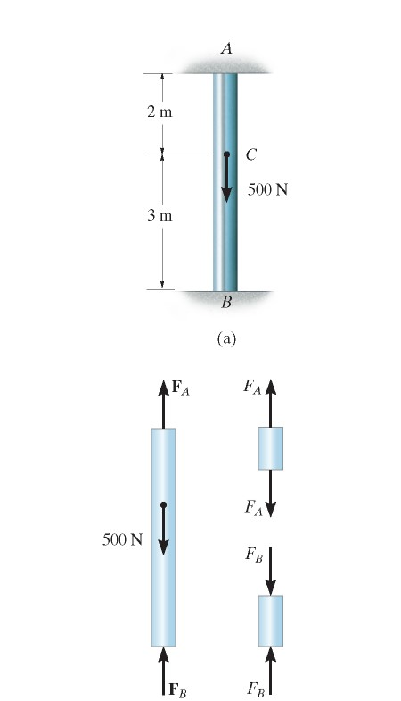
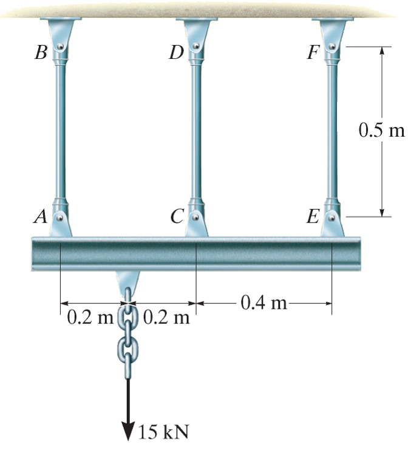
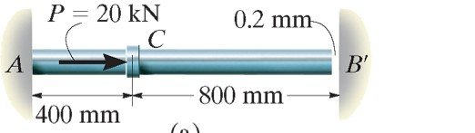
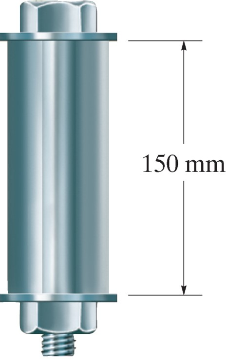
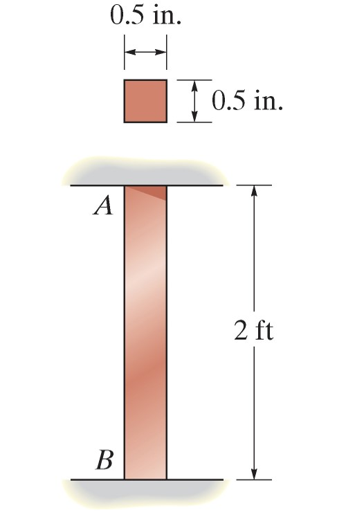
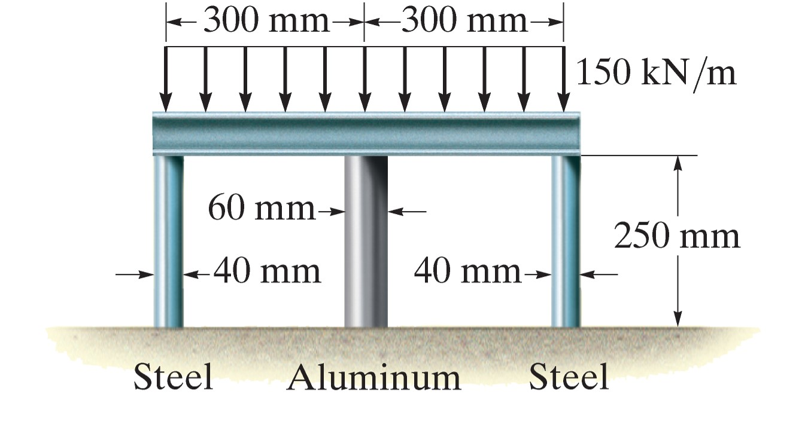
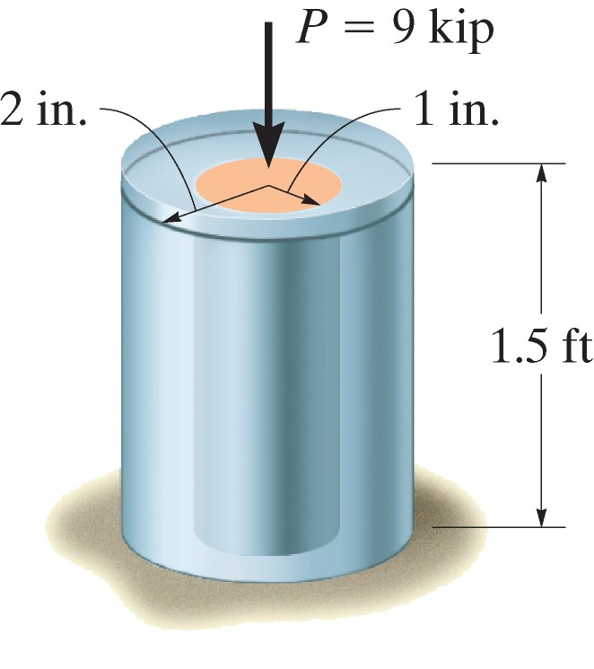
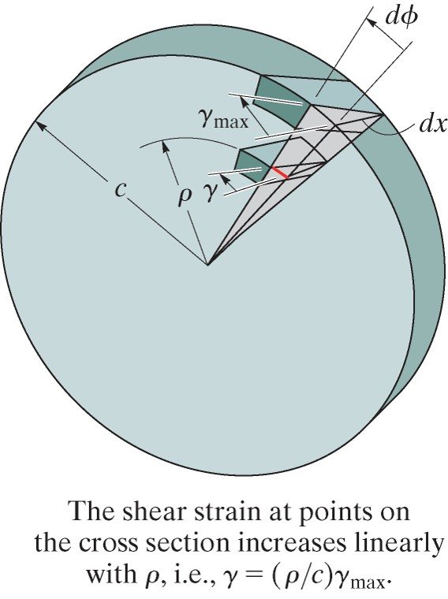

# AE333
## Mechanics of Materials
Lecture 8 - Axial Load, Torsion 
Dr. Nicholas Smith 
Wichita State University, Department of Aerospace Engineering

13 September, 2021

----
## schedule

- 13 Sep - Project 1 Due
- 13 Sep - Axial Load
- 15 Sep - Torsion
- 17 Sep - Homework 2 Self-Grade Due
- 20 Sep - Torsion
- 22 Sep - Bending
- 24 Sep - Homework 3 Due, Project 1 Recovery Due

----
## outline

- superposition
- statically indeterminate
- force method
- thermal stress
- torsion

---
# superposition

----
## superposition

-   Some problems are too complicated to solve all at once
-   Instead, we break them up into two simpler problems
-   Each "sub-problem" must still satisfy equilibrium
-   Problem must be linear and the deformation should be small enough that it does not cause moment-equilibrium issues

---
# statically indeterminate

----
## statically indeterminate

-   There are many problems that are at least slightly over-constrained
-   While this is common engineering practice, it creates too many variables for statics analysis
-   These problems are called "statically indeterminate"

----
## statically indeterminate

-   One extra equation we can use is called "compatibility" or the "kinematic condition"
-   We know that at the displacement must be equal on both sides of any arbitrary section we make in a member
-   We can separate a member into two parts, then use compatibility to relate the two unknown forces

----
## statically indeterminate

 <!-- .element width="25%" -->

----
## example 4.7

Assuming the bottom bar is rigid, find the force developed in each bar.
AB and EF have cross-sectional areas of 50 mm2 while CD has a cross-sectional area of 30 mm2.

---
# force method

----
## force method

-   One way to solve statically indeterminate problems is using the principle of superposition
-   We choose one redundant support and remove it
-   We then add it back as a force separately (without the other forces in the problem)

----
## force method

----
## force method

-   We connect the two problems by requiring that the displacement in both frames adds to 0 to meet the support requirements
-   This is referred to as the equation of compatibility

----
## procedure

-   Choose one support as redundant, write the equation of compatibility
-   Express the external load and redundant displacements in terms of load-displacement relationship
-   Draw free body diagrams and use the equations of equilibrium to solve

----
## example 4.9

The steel rod shown has a diameter of 10 mm. Determine the reactions at A and B'.

---
# thermal stress

----
## thermal stress

-   A change in temperature cases a material to either expand or contract
-   For most materials this is linear and can be described using the coefficient of linear expansion

`$$\delta_T = \alpha \Delta T L$$`

----
## thermal stress

-   When a body is free to expand, the deformation can be readily calculated using
-   If it is not free to expand, however, thermal stresses develop
-   We can use the force method described previously to find the thermal stresses developed

----
## example 4.12

An aluminum tube with cross-section of 600 mm2 is used as a sleeve for a steel bolt with cross-sectional area of 400 mm2. When T=15 degrees Celsius there is negligible force and a snug fit, find the force in the bolt and sleeve when T=80 degrees Celsius.

---
# group problems

----
## problem 1

The A36 Steel bar is constrained to just fit between two fixed supports when `$T_1 = 60^\circ\text{F}$`.
If the temperature is raised to `$T_2 = 120^\circ\text{F}$` determine the average normal stress developed in the bar.
Note: you may use `$\alpha = 6.5\times 10^{-6 \circ} \text{F}^{-1}$`

----
## problem 2

 <!-- .element width="30%" -->

 <!-- .element width="70%" -->

The rigid beam is fixed to the top of three posts made from A992 steel and 2014 T-6 aluminum.
The posts each have a length of 250 mm when no load is applied to the beam and the temperature is `$T_1 = 20^\circ \text{C}$`.
Determine the force supported by each post if the bar is subjected to a uniformly distributed load of `$150 \text{ kN/m}$` and the temperature is raised to `$T_2 = 80^\circ \text{C}$`
Use `$E_{st} = 200 \text{ GPa}$`, `$E_{al} = 70 \text{ GPa}$`, `$\alpha_{st} = 12 \times 10^{-6 \circ} \text{C}^{-1}$` and `$\alpha_{al} = 23 \times 10^{-6 \circ} \text{C}^{-1}$`

----
## problem 3

The aluminum post shown is reinforced with a brass core.
If this assembly supports an axial compressive load of `$P = 9 \text{ kip}$` determine the average normal stress in the aluminum and the brass.
Use `$E_{al} = 10 \text{ Msi}$` and `$E_{br} = 15 \text{ Msi}$`

---
# torsion

----
## torsion

-   Torque is a moment that tends to twist a member about its axis
-   For small deformation problems, we assume that the length and radius do not change significantly under torsion
-   The primary deformation we are concerned with in torsion is the angle of twist, denoted with `$\phi$`

----
## shear

 <!-- .element width="40%" -->

----
## torsion formula

-   For a linearly elastic material, Hooke’s Law in shear will hold (`$\tau = G \gamma$`)
-   This means that, like shear strain, shear stress will vary linearly along the radius

----
## torsion formula

-   We can find the total force on an element, *dA* by multiplying the shear stress by the area

`$$ dF = \tau dA$$`

-   The torque (`$dT = \rho dF$`) produced by this force is then

`$$dT = \rho(\tau dA)$$`

----
## torsion formula

-   Integrating over the whole cross-section gives

`$$T = \int_A \rho (\tau dA) = \frac{\tau_{max}}{c} \int_A \rho^2 dA$$`

-   The integral `$\int_A \rho^2 dA$` is also called the Polar Moment of Inertia, *J*, so we can write

`$$\tau_{max} = \frac{Tc}{J}$$`

----
## polar moment of inertia

-   We know that `$J=\int_A \rho^2 dA$`, so we can compute this for some common shapes
-   For a solid circular cross-section, we have

`$$J = \int_0^c \rho^2 (2\pi \rho d\rho) = \frac{\pi}{2}c^4$$`

-   For a circular tube we have

`$$J = \int_{c_1}^{c_2} \rho^2 (2\pi \rho d\rho) = \frac{\pi}{2}(c_2^4-c_1^4)$$`

----
## example 5.1

The allowable shear stress is 75 MPa. Determine the maximum torque that can be applied to each of the cross-sections shown and find the stress acting on a small element at A, B and C.

