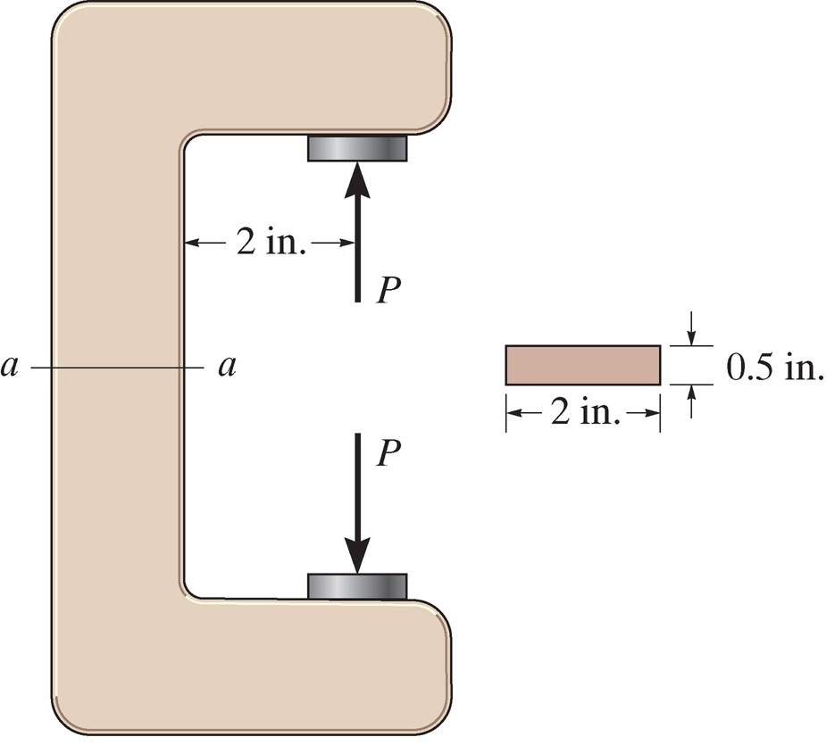

## AE333
## Mechanics of Materials
Lecture 15 - Combined Loading 
Dr. Nicholas Smith 
Wichita State University, Department of Aerospace Engineering

25 October, 2021

----
## schedule

- 25 Oct - SPTE, Combined Loading
- 27 Oct - Exam Return, Stress Transormation
- 1 Nov - Mohr's Circle
- 29 Oct - Project 2 Due, HW 6 Self-Grade Due
- 3 Nov - Strain Transformation

----
## outline
<!-- vim-markdown-toc GFM -->

* pressure vessels
* combined loading
* group problems

<!-- vim-markdown-toc -->

---
# pressure vessels 

----
## thin-walled pressure vessels

-   If the radius to wall thickness ratio is 10 or more, we can treat a pressure vessel as “thin-walled”
-   Cylindrical pressure vessels will have two primary sources of stress, and serve as an introduction to more general states of combined loading

----
## cylindrical vessels

 <!-- .element width="30%" -->

----
## cylindrical vessels

-   From equilibrium of a section of a cylindrical vessel, we see that

`$$\begin{aligned}
  \sum F_x &= 0\\
  &= 2(\sigma_1 t dy) - p (2r) dy\\
  \sigma_1 &= \frac{pr}{t}
\end{aligned}$$`

----
## cylindrical vessels

 <!-- .element width="50%" -->

----
## cylindrical vessels

-   Considering another section we can find the longitudinal stress

`$$\begin{aligned}
  \sum F_y &= 0\\
  &= \sigma_2 (2\pi rt) - p (\pi r^2)\\
  \sigma_2 &= \frac{pr}{2t}
\end{aligned}$$`

----
## spherical vessels

-   We can find the stress in spherical vessels using an identical section to the longitudinal section for a cylindrical vessel, and we find that

`$$\sigma = \frac{pr}{2t}$$`

-   Which is valid everywhere in a cylindrical vessel

----
## example 8.1

-   A cylindrical pressure vessel has an inner diameter of 4 ft and a thickness of 1/2 in.
-   Determine the maximum internal pressure it can sustain if the maximum stress it can support is 20 ksi.
-   What is the maximum internal pressure a spherical pressure vessel could sustain under identical conditions?

---
# combined loading

----
## combined loading

-   We can use the principle of superposition to treat various loading conditions separately and then add them together to find the total stress

----
## procedure

-   Section the member at the point of interest, internal force components should be drawn acting through the centroid of the section
-   Moment components should be calculated about the centroidal axis

----
## stress components

-   Normal stress: `$\sigma = N/A$`
-   Torsion: `$\tau = \frac{T\rho}{J}$`
-   Bending: `$\sigma = \frac{-My}{I}$`
-   Transverse Shear: `$\tau = \frac{VQ}{It}$`
-   Pressure Vessels: `$\sigma_1 = \frac{pr}{t}$`, `$\sigma_2 = \frac{pr}{2t}$`

----
## example 8.2

 <!-- .element width="30%" -->

Neglect the weight of the member and find the stress at B and C.

----
## example 8.4

 

Determine the stress at C and D.

----
## example 8.5

 <!-- .element width="30%" -->

The rod shown has a radius of 0.75 in. Find the stress at A.

---
# group problems

----
## group one

 <!-- .element width="40%" -->

Find the stress at the corners A and B for the column shown.

----
## group two

 <!-- .element width="30%" -->

Find the stress at point A for the cantilever beam shown.

----
## group three

  <!-- .element width="30%" -->

Find the load P that will cause a maximum normal stress of `$\sigma = 30$` ksi along the section a-a.

