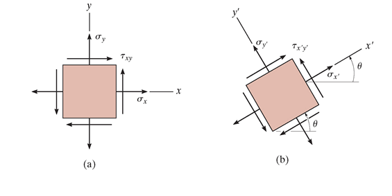
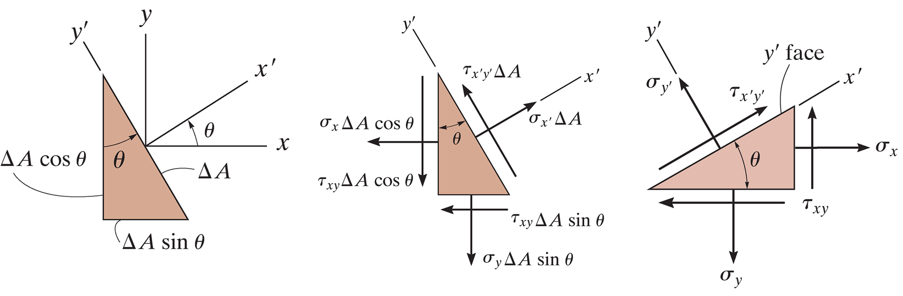
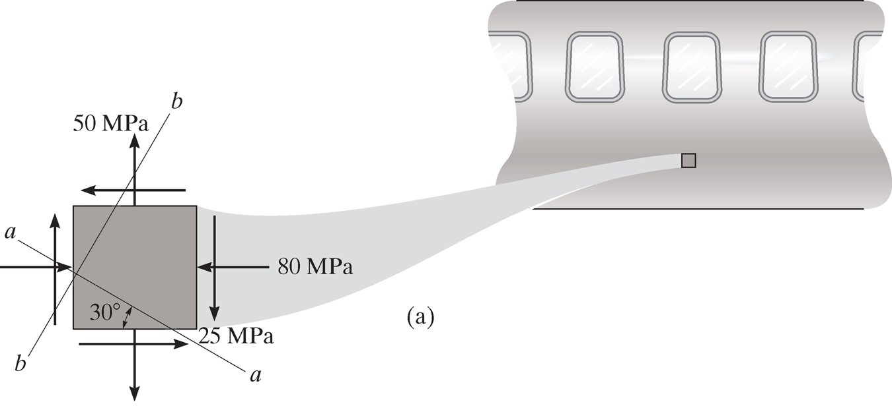
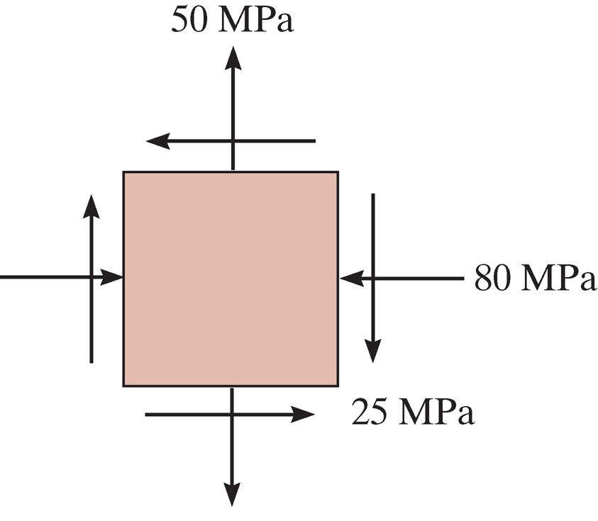
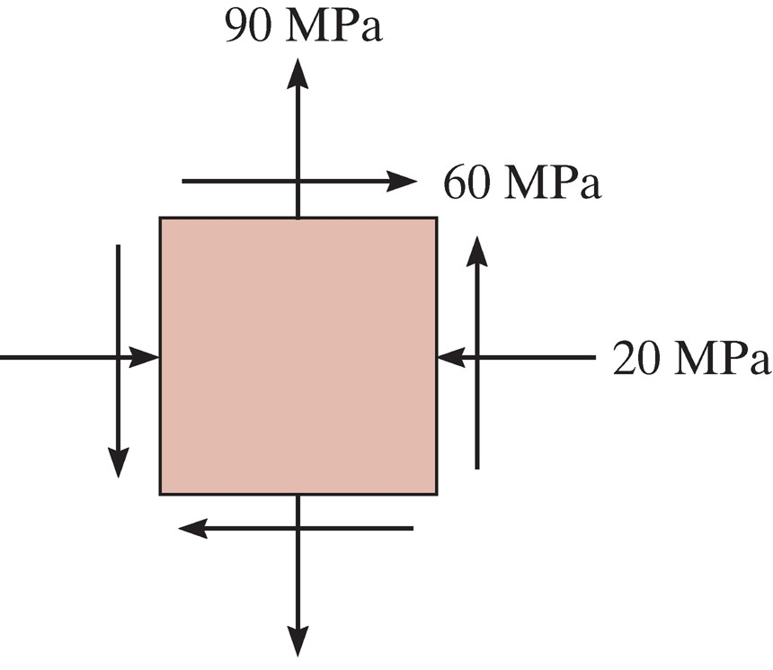
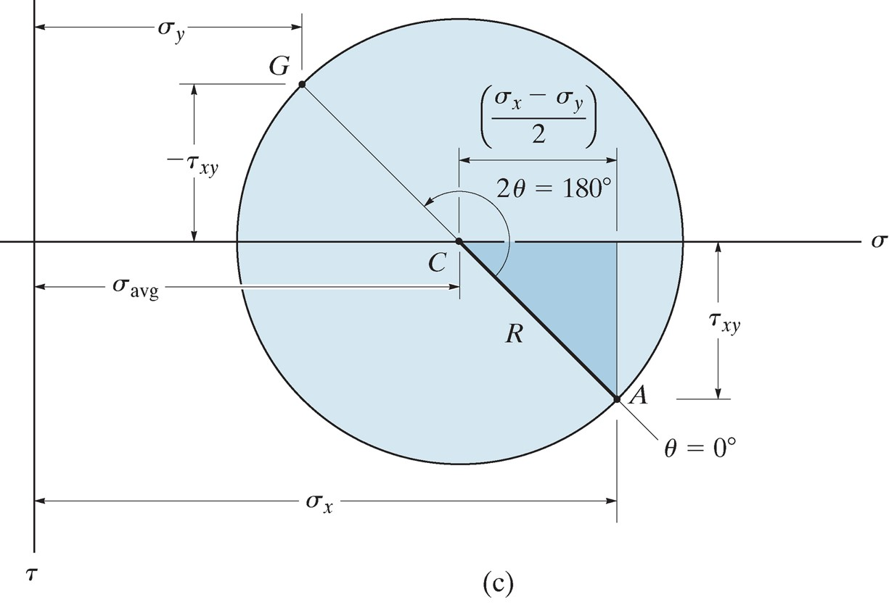
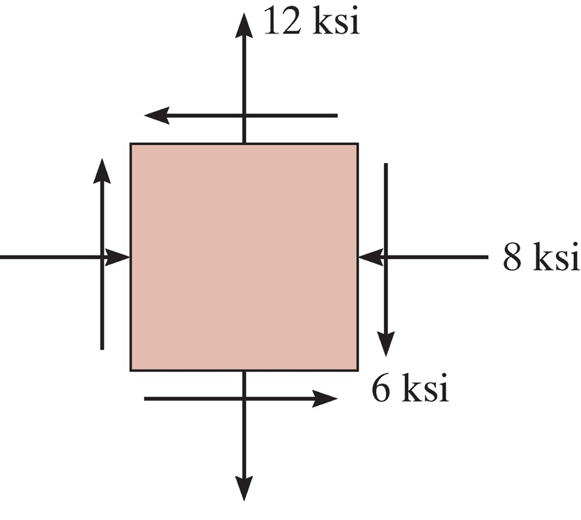

## AE333
## Mechanics of Materials
Lecture 16 - Stress Transformation 
Dr. Nicholas Smith 
Wichita State University, Department of Aerospace Engineering

7 April, 2021

----
## schedule

- 7 April - Stress Transformation
- 12 April - Stress Transformation, HW 7 Due
- 14 April - Strain Transformation
- 19 April - Beam Deflection, HW 7 Self-grade Due, HW 8 Due

----
## outline

<!-- vim-markdown-toc GFM -->

* plane stress transformation
* general equations
* principal stresses
* mohr’s circle

<!-- vim-markdown-toc -->

---
# plane stress transformation

----
## plane stress

-   In general, the state of stress at a point is characterized by six stress components
-   In practice, this is rare, as most stresses and forces act in the same plane
-   This case is referred to as plane stress

----
## transformation

----
## procedure

-   If the state of stress `$(\sigma_x, \sigma_y, \tau_{xy}$` is known for a known axis system *x* and *y*, we can find the stress relative to some rotated coordinate system
-   We do this by considering a section of the element perpendicular to the `$x^\prime$`
-   Sum of forces in *x* and *y* will give `$\sigma_x^\prime$` and `$\tau_{xy}$`
-   A second section is needed to find `$\sigma_y^\prime$` perpendicular to the `$y^\prime$` axis

----
## procedure

----
## example 9.1

 <!-- .element width="50%" -->

Represent the state of stress shown on the fuselage section on an element rotated 30&deg; clockwise from the position shown.

---
# general equations

----
## general equations

-   We can follow the methodology from the previous section to develop equations for some arbitrary rotation and a completely general state of stress
-   We use some trig identities to simplify the formulae

`$$\begin{aligned}
  \sigma_{x^\prime} &= \frac{\sigma_x+\sigma_y}{2} + \frac{\sigma_x-\sigma_y}{2} \cos 2\theta + \tau_{xy} \sin 2\theta \\
  \tau_{x^\prime y^\prime} &= - \frac{\sigma_x-\sigma_y}{2}\sin 2\theta + \tau_{xy} \cos 2\theta
\end{aligned}$$`
-   To find `$\sigma_y^\prime$` we can simply add `$90^\circ$` to `$\theta$`

----
## procedure

-   The procedure in general is mostly “plug and chug”
-   The only thing we need to be cautious about is sign convention: stresses are positive in tension, shear is positive with arrows pointing to the 1st and 3rd quadrants, `$\theta$` is measured counter-clockwise from the *x*-axis

----
## example 9.2

 <!-- .element width="40%" -->

Determine the stress at this point on an element rotated 30`$^\circ$` clockwise from the position shown.

---
# principal stresses

----
## principal stresses

-   Since the local stresses only change with the rotation angle, we might like to find the angle with gives the maximum stress
-   This is known as the principal direction, and the stresses are known as principal stresses
-   We can find this direction by differentiating the equation for `$\sigma_x^\prime$`

----
## principal stress

-   We find the angle as
`$$\tan 2\theta_p = \frac{2 \tau_{xy}}{\sigma_x-\sigma_y}$$`

-   The principal stresses are then
`$$\sigma_{1,2} = \frac{\sigma_x+\sigma_y}{2} \pm \sqrt {\left( \frac{\sigma_x-\sigma_y}{2}\right)^2 + \tau_{xy}^2}$$`

----
## maximum shear stress

-   Similarly, we might want to find the direction of maximum shear stress
`$$\tan 2\theta_s = \frac{\sigma_y-\sigma_x}{2 \tau_{xy}}$$`

-   And the maximum shear stress is
`$$\tau_{max} = \sqrt{\left( \frac{\sigma_x-\sigma_y}{2} \right)^2 + \tau_{xy}^2}$$`

----
## example 9.3

 <!-- .element width="45%" -->

Find the principal stress for the stress state shown.

----
## example 9.5

-   When torsional loading *T* is applied to a circular bar it produces a state of pure shear stress.
-   Find the maximum in-plane shear stress and the associated average normal stress
-   Find the principal stresses

---
# mohr’s circle

----
## mohr’s circle

-   We can visualize plane stress transformation using a technique known as Mohr’s circle
-   If we re-write the stress transformation equations we find

`$$\begin{aligned}
 \sigma_{x^\prime} - \left( \frac{\sigma_x + \sigma_y}{2} \right) &= \left( \frac{\sigma_x - \sigma_y}{2} \right) \cos 2 \theta + \tau_{xy} \sin 2\theta \\
 \tau_{x^\prime y^\prime} &= -\left( \frac{\sigma_x - \sigma_y}{2} \right) \sin 2\theta + \tau_{xy} \cos 2\theta
\end{aligned}$$`

----
## mohr’s circle

-   If we square each equation and add them together, we find

`$$\left\[\sigma_{x^\prime} - \left( \frac{\sigma_x + \sigma_y}{2} \right) \right\]^2 + \tau_{x^\prime y^\prime}^2 = \left( \frac{\sigma_x - \sigma_y}{2} \right)^2+\tau_{xy}^2$$`

----
## mohr’s circle

-   Since `$\sigma_x$`, `$\sigma_y$` and `$\tau_{xy}$` are known constants, we can write a more compact form by letting

`$$\begin{aligned}
  (\sigma_{x^\prime}-\sigma_{avg})^2 + \tau_{x^\prime y^\prime}^2 &= R^2\\
   \sigma_{avg} &= \frac{\sigma_x+\sigma_y}{2}\\
   R &= \sqrt{ \left( \frac{\sigma_x - \sigma_y}{2} \right)^2 + \tau_{xy}^2}
\end{aligned}$$`

----
## mohr’s circle

-   Re-written in this way, we can see that the previous equation is the equation of a circle on the `$\sigma, \tau$` axis
-   The center of the circle is at `$\tau = 0$` and `$\sigma = \sigma_{avg}$`
-   The radius of the circle is `$\sqrt{ \left( \frac{\sigma_x - \sigma_y}{2} \right)^2 + \tau_{xy}^2}$`
-   Each point on the circle represents `$(\sigma_x^\prime, \tau_{xy}^\prime)$`

----
## mohr’s circle

 <!-- .element width="60%" -->

----
## visual construction of Mohr’s circle

-   By convention, positive `$\tau$` points down, use this convention to plot the center of the circle and a reference point at `$(\sigma_x^\prime, \tau_{xy}^\prime)$` where the `$x^\prime$` axis is coincident with the *x* axis
-   Use these two points to sketch the circle

----
## principal stress

-   The principal stresses, `$\sigma_1$`and `$\sigma_2$` are the coordinates where Mohr’s circle intersects the `$\sigma$` axis
-   The angles `$\theta_{p1}$` and `$\theta_{p2}$` can be found by calculating the angle between the reference line and the `$\sigma$` axis (note that this angle is equal to `$2\theta_p$`)
-   Note that the direction from the reference point to the `$\sigma$` axis will be the same as the direction from the *x* axis to the principal axis

----
## maximum shear stress

-   The top and bottom of the circle represent the maximum shear stress
-   The angles `$\theta_{s1}$` and `$\theta_{s2}$` can be found in a similar method to that described for the principal stress

----
## stress on arbitrary plane

-   To find the stress at some arbitrary plane some known angle `$\theta$` away from our reference plane, we find the angle `$2\theta$` away from the reference line on Mohr’s circle
-   We can use trigonometry to find the value of the coordinates at that point
-   We must draw our angle in the same direction as the desired rotation

----
## example 9.9

 <!-- .element width="35%" -->

Represent the state of stress shown on an element rotated `$30^\circ$` counterclockwise from the position shown.

