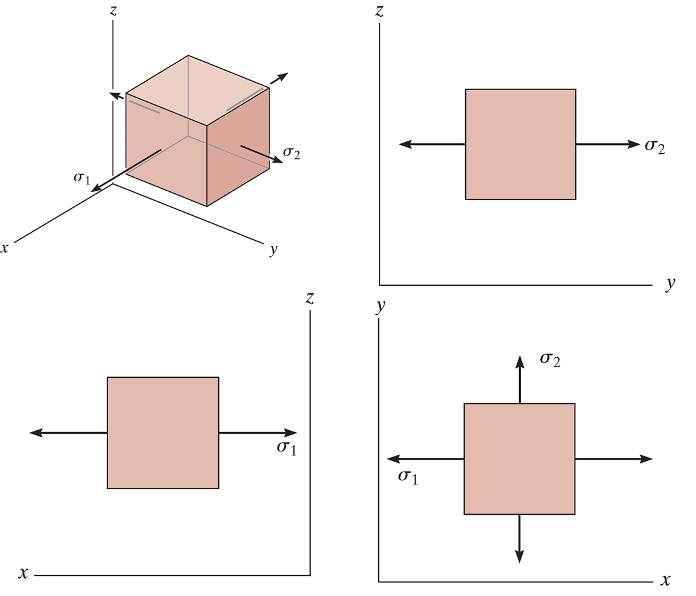
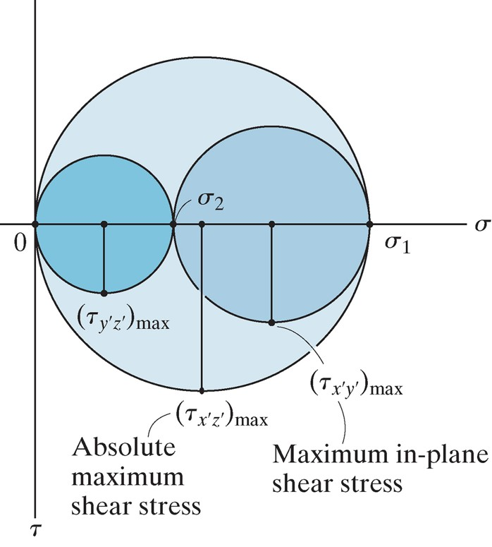
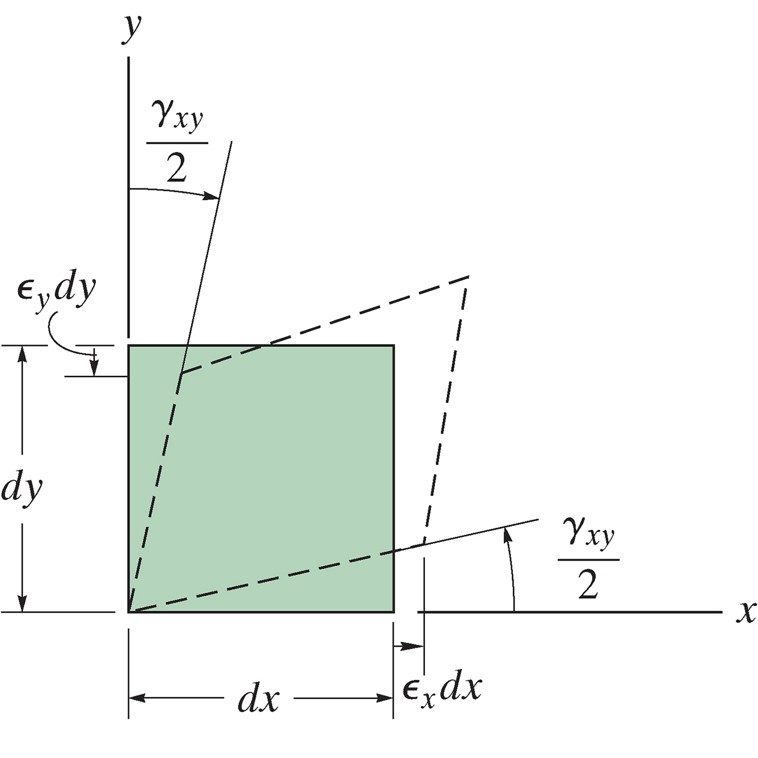
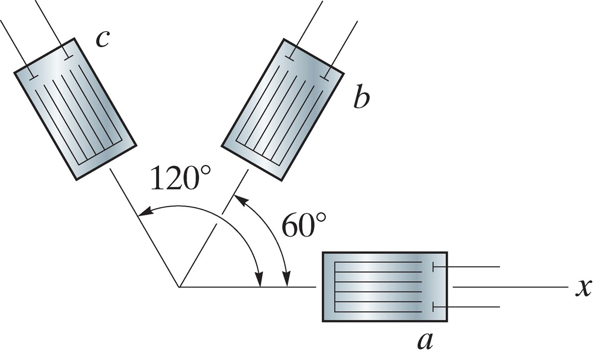

## AE333
## Mechanics of Materials
Lecture 17 - Strain Transformation 
Dr. Nicholas Smith 
Wichita State University, Department of Aerospace Engineering

12 April, 2021

----
## schedule

- 12 April - Stress Transformation, HW 7 Due
- 14 April - Strain Transformation
- 19 April - Beam Deflection, HW 7 Self-grade Due, HW 8 Due
- 21 April - Beam Deflection

----
## outline

<!-- vim-markdown-toc GFM -->

* absolute maximum shear
* plane strain
* principal strains and mohr’s circle
* strain rosettes
* material property relationships

<!-- vim-markdown-toc -->

---
# absolute maximum shear

----
## absolute maximum shear

-   We already know how to find the maximum in-plane shear, but sometimes the maximum shear stress can occur in another plane
-   We can do this (without treating it as a fully 3D problem) by treating each plane as its own plane stress problem

----
## mohr’s circle

 <!-- .element width="40%" -->

----
## mohr’s circle

 <!-- .element width="40%" -->

----
## absolute max shear

-   The maximum absolute shear will depend on whether `$\sigma_1$` and `$\sigma_1$` are in the same or opposite directions

`$$\begin{aligned}
  \tau_{abs,max} &= \frac{\sigma_1}{2} & \qquad \text{same direction} \\
  \tau_{abs,max} &= \frac{\sigma_1-\sigma_2}{2} & \qquad \text{opposite directions}
\end{aligned}$$`

-   Which of the three mohr’s circles the maximum occurs in will determine which plane the shear acts in

---
# plane strain

----
## plane strain

-   Under plane stress we assume no out-of-plane stresses are present
-   This is typically a good assumption for very thin materials
-   Under plane strain we assume no out-of-plane strains are present
-   Typically a good assumption for very thick materials

----
## sign convention

-   Normal strains, `$\epsilon_x$` and `$\epsilon_y$`, are considered positive when they cause elongation, and negative when they cause contraction
-   Shear strains, `$\gamma_{xy}$` are positive if the interior angle becomes smaller than `$90^\circ$` and negative if the angles becomes larger than `$90^\circ$`

----
## general equations

-   We derive the general strain transformation equations by comparing infinitesimal elements before and after deformation
-   To find `$\gamma_{x^\prime y^\prime}$` we compare the angle between *dx* and *dy* before and after deformation

----
## general equations

-   The equations are nearly exactly the same as the stress transformation equations
-   Pay attention to the difference, strain transformation equations are NOT on the equation sheet

`$$\begin{aligned}
  \epsilon_{x^\prime} &= \frac{\epsilon_x+\epsilon_y}{2} + \frac{\epsilon_x-\epsilon_y}{2}\cos 2 \theta + \frac{\gamma_{xy}}{2} \sin 2\theta \\
  \frac{\gamma_{x^\prime y^\prime}}{2} &= -\left( \frac{\epsilon_x-\epsilon_y}{2}\right)\sin 2 \theta + \frac{\gamma_{xy}}{2} \cos 2\theta
\end{aligned}$$`

-   As with `$\sigma_{y^\prime}$`, we find `$\epsilon_{y^\prime}$` by letting `$\theta_y = \theta_x + 90^\circ$`

----
## engineering strain

-   Side note: there is another definition of shear strain known as tensorial shear strain, where `$\gamma_{xy} = 2 \epsilon_{xy}$`
-   Under tensorial strain, the transformation equations are exactly the same (as in this case both stress and strain are tensors)
-   `$\gamma_{xy}$` is known as engineering strain, you will need to pay attention to which strain convention is used when extracting data from finite elements or other sources

---
# principal strains and mohr’s circle

----
## principal strains

-   As you might imagine, since the transformation equations are nearly identical so are the principal strain equations

`$$\begin{aligned}
  \tan 2\theta_p &= \frac{\gamma_{xy}}{\epsilon_x-\epsilon_y}\\
  \epsilon_{1,2} &= \frac{\epsilon_x+\epsilon_y}{2} \pm \sqrt{ \left( \frac{\epsilon_x-\epsilon_y}{2}\right)^2 + \left(\frac{\gamma_{xy}}{2}\right)^2}
\end{aligned}$$`

----
## mohr’s circle

-   Mohr’s circle can also be used in exactly the same way for strain as it is for stress
-   The only difference is that the vertical axis is tensor strain, or `$\gamma_{xy}/2$`

----
## example 10.4

 

The state of plane strain at a point has components of `$\epsilon_x = 250 \mu \epsilon$`, `$\epsilon_y = -150 \mu \epsilon$`, and `$\gamma_{xy} = 120 \mu \epsilon$`. Determine the principal strains and the direction they act.

---
# strain rosettes

----
## rosettes

-   Normal strain is fairly easy to measure using a strain gage
-   Shear strain is more difficult to measure directly, so instead a “rosette” of normal strain gages is used
-   We can use the strain transformation equations to determine `$\gamma_{xy}$`

----
## rosettes

-   Usually, we have `$\theta_a = 0$`, `$\theta_b = 90$` and `$\theta_c = 45$` OR `$\theta_a = 0$`, `$\theta_b=60$` and `$\theta_c=120$`

`$$\begin{aligned}
  \epsilon_{a} &= \frac{\epsilon_x+\epsilon_y}{2} + \frac{\epsilon_x-\epsilon_y}{2}\cos 2 \theta_a + \frac{\gamma_{xy}}{2} \sin 2\theta_a \\
  \epsilon_{b} &= \frac{\epsilon_x+\epsilon_y}{2} + \frac{\epsilon_x-\epsilon_y}{2}\cos 2 \theta_b + \frac{\gamma_{xy}}{2} \sin 2\theta_b \\
  \epsilon_{c} &= \frac{\epsilon_x+\epsilon_y}{2} + \frac{\epsilon_x-\epsilon_y}{2}\cos 2 \theta_c + \frac{\gamma_{xy}}{2} \sin 2\theta_c
\end{aligned}$$`

----
## example 10.8

 

The readings from the rosette shown are `$\epsilon_a=60\mu\epsilon$`, `$\epsilon_b=135\mu\epsilon$` and `$\epsilon_c=264\mu\epsilon$`. Find the in-plane principal strains and their directions.

---
# material property relationships

----
## generalized hooke’s law

-   We have previously used Hooke’s Law in 2D, in 3D we have

`$$\begin{aligned}
  \epsilon_x &= \frac{1}{E}\[\sigma_x - \nu(\sigma_y + \sigma_z)\]\\
  \epsilon_y &= \frac{1}{E}\[\sigma_y - \nu(\sigma_x + \sigma_z)\]\\
  \epsilon_z &= \frac{1}{E}\[\sigma_z - \nu(\sigma_x + \sigma_y)\]
\end{aligned}$$`

----
## generalized hooke’s law

-   And in shear

`$$\begin{aligned}
  \gamma_{xy} &= \frac{1}{G} \tau_{xy}\\
  \gamma_{yz} &= \frac{1}{G} \tau_{yz}\\
  \gamma_{xz} &= \frac{1}{G} \tau_{xz}
\end{aligned}$$`

----
## dilatation

-   When a material deforms it often changes volume
-   The change in volume per unit volume is called “volumetric strain” or dilatation

`$$e = \frac{\partial V}{d V} = \epsilon_x + \epsilon_y + \epsilon_z = \frac{1-2\nu}{E}(\sigma_x+\sigma_y+\sigma_z)$$`

----
## hydrostatic pressure

-   One way of characterizing volumetric response is to apply hydrostatic pressure (equal compression on all sides with no shear)
-   Under this case, we have

`$$\frac{p}{e} = -\frac{E}{3(1-2\nu)}$$`

-   We call the term on the right (with no negative sign) the bulk modulus, *k*

