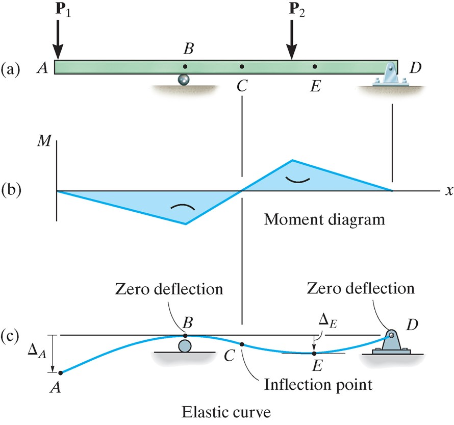
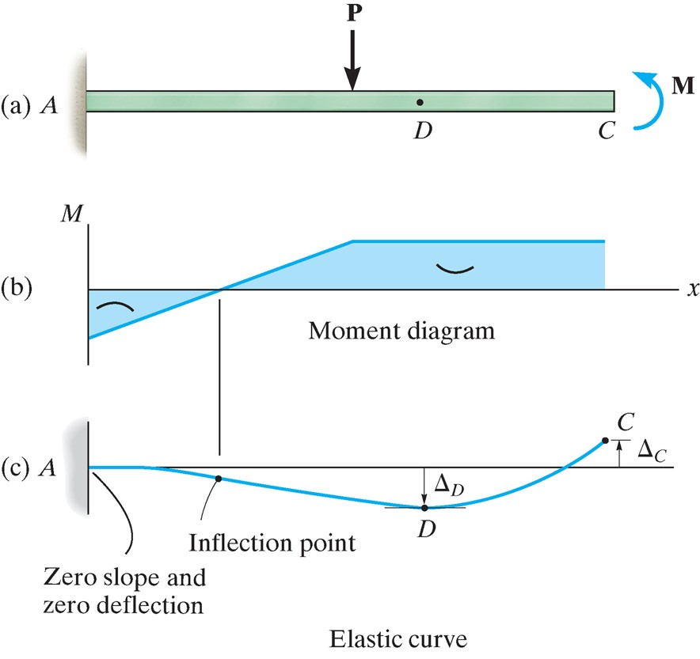
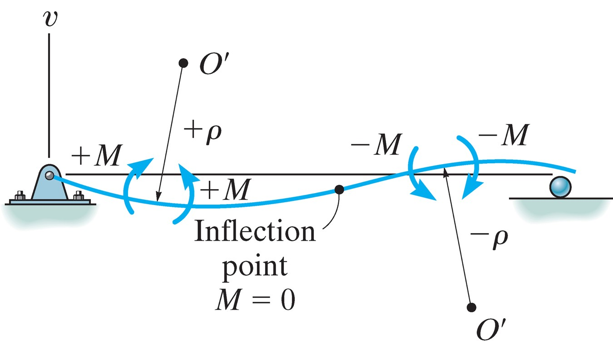
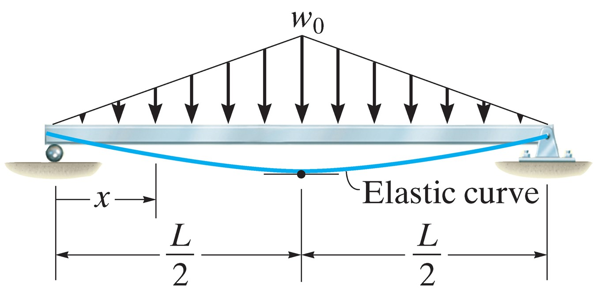
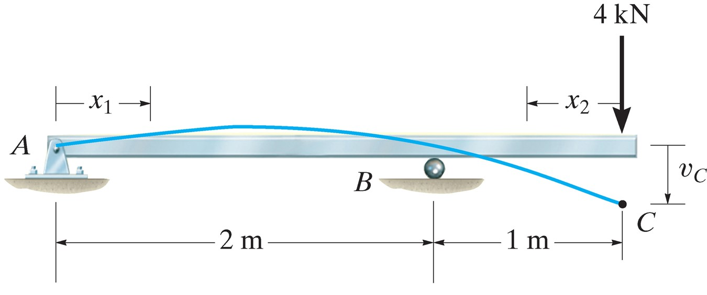

## AE333
## Mechanics of Materials
Lecture 18 - Deflection of Beams 
Dr. Nicholas Smith 
Wichita State University, Department of Aerospace Engineering

3 November, 2021

----
## schedule

- 3 Nov - Strain Transformation
- 5 Nov - HW 7 Due
- 8 Nov - Beam Deflection
- 10 Nov - Beam Deflection (discontinuity functions)
- 12 Nov - HW 8 Due, HW 7 Self-grade Due
- 15 Nov - Beam Deflection (superposition)

----
## outline

<!-- vim-markdown-toc GFM -->

* deflection of beams and shafts
* slope and displacement

<!-- vim-markdown-toc -->

---
# deflection of beams and shafts

----
## elastic curve

-   Before finding the exact displacement, it is useful to sketch the approximate deformed shape of a beam
-   For difficult beams, it is useful to draw the moment curve first
-   Positive internal moment tends to bend the beam concave up, while negative moment tends to bend the beam concave down

----
## elastic curve

 <!-- .element width="40%" -->

----
## elastic curve

 <!-- .element width="40%" -->

----
## moment-curvature

-   In Chapter 6 we compared the strain in a segement of a beam to the radius of curvature and found

`$$\frac{1}{\rho} = -\frac{\epsilon}{y}$$`

-   Since Hooke’s Law applies, `$\epsilon = \sigma/E = - My/EI$`, substituting gives

`$$\frac{1}{\rho} = \frac{M}{EI}$$`

----
## sign convention

 <!-- .element width="60%" -->

`$\rho$` is positive when the center of the arc is above the beam, negative when it is below.

---
# slope and displacement

----
## curvature

-   When talking about displacement in beams, we use the coordinates *v* and *x*, where *v* is the vertical displacement and *x* is the horizontal position
-   In this notation, curvature is formally related to displacement according to

`$$\frac{1}{\rho} = \frac{d^2v/dx^2}{\[1+(dv/dx)^2\]^{3/2}} = \frac{M}{EI}$$`

----
## curvature

-   The previous equation is difficult to solve in general, but for cases of small displacement, `$\left( \frac{dv}{dx} \right)^2$` will be negligible compared to 1, which then simplifies to

`$$\frac{d^2v}{dx^2} = \frac{M}{EI}$$`

----
## flexural rigidity

-   In general, *M*, is a function of *x*, but *EI* (known as the flexural rigidity) is a constant along the length of the beam
-   In this case, we can say

`$$\begin{aligned}
  EI\frac{d^2v}{dx^2} &= M(x) \\
  EI\frac{d^3v}{dx^3} &= V(x) \\
  EI\frac{d^4v}{dx^4} &= w(x)
\end{aligned}$$`

----
## boundary conditions

-   If a support restricts displacement, but not rotation, we will have a boundary condition of *v* = 0 at that point
-   Supports that restrict rotation give a boundary condition that `$\theta = 0$`

----
## continuity conditions

-   If we have a piecewise function for *M*(*x*), not all integration constants can be found from the boundary conditions
-   Instead, we must also use continuity conditions to ensure that the slope and displacement are continuous at every point
-   In other words, for two sets of functions, `$\theta_1(x)$` and `$v_1(x)$`, `$\theta_2(x)$` and `$v_2(x)$`, `$\theta_1(a) = \theta_2(a)$` and `$v_1(a) = v_2(a)$`

----
## slope

-   For small displacements, we have

`$$ \theta \approx \tan(\theta) = dv/dx $$`

----
## example 12.1

 <!-- .element width="60%" -->

Determine the maximum deflection if EI is constant.

----
## example 12.4

Determine the displacement at C, EI is constant.
