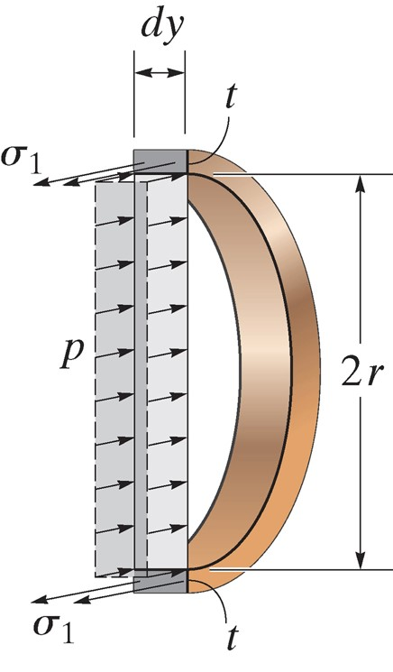
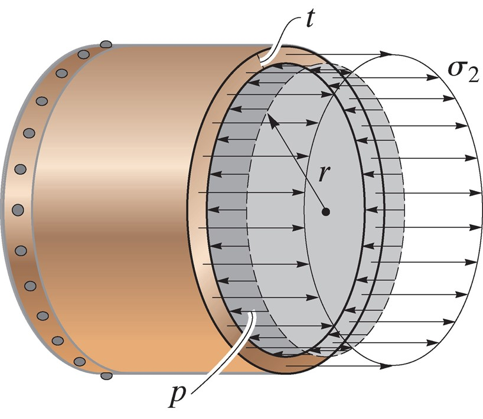
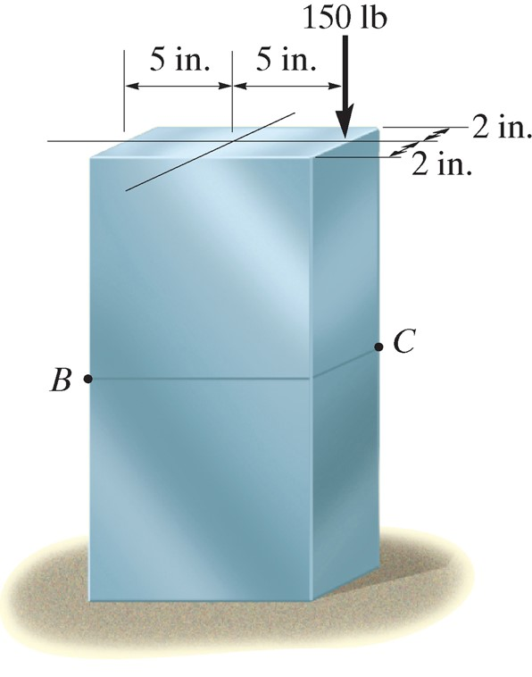
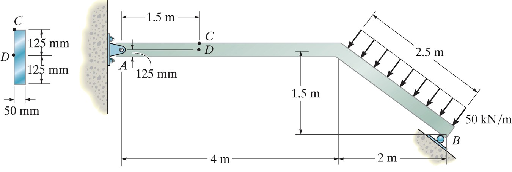
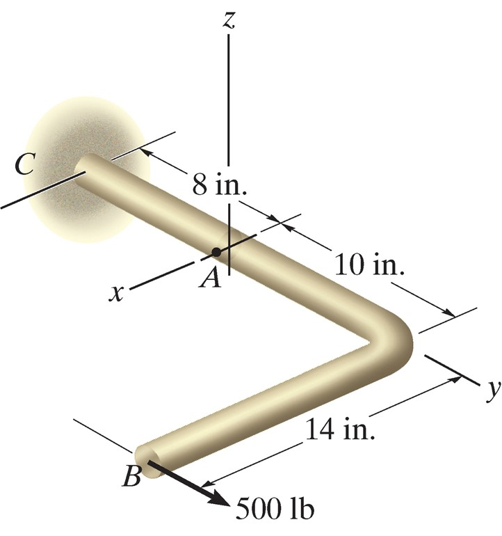

## AE333
## Mechanics of Materials
Lecture 20 - Combined loading 
Dr. Nicholas Smith 
Wichita State University, Department of Aerospace Engineering

22 Mar, 2019

----

## schedule

- 25 Mar - Combined Loading, HW6 Due
- 27 Mar - Combined Loading
- 29 Mar - Combined Loading
- 1 Apr - Stress Transformation, HW7 Due

----
## outline

---
# thin-walled pressure vessels

----
## thin-walled pressure vessels

-   If the radius to wall thickness ratio is 10 or more, we can treet a pressure vessule as “thin-walled”
-   Cylindrical pressure vessels will have two primary sources of stress, and serve as an introduction to more general states of combined loading

----
## cylindrical vessels

----
## cylindrical vessels

-   From equilibrium of a section of a cylindrical vessel, we see that
$$\\begin{aligned}
  \\sum F\_x &= 0\\\\
  &= 2(\\sigma\_1 t dy) - p (2r) dy\\\\
  \\sigma\_1 &= \\frac{pr}{t}
\\end{aligned}$$

----
## cylindrical vessels

----
## cylindrical vessels

-   Considering another section we can find the longitudinal stress
$$\\begin{aligned}
  \\sum F\_y &= 0\\\\
  &= \\sigma\_2 (2\\pi rt) - p (\\pi r^2)\\\\
  \\sigma\_2 &= \\frac{pr}{2t}
\\end{aligned}$$

----
## spherical vessels

-   We can find the stress in spherical vessels using an identical section to the longitudinal section for a cylindrical vessel, and we find that
$$\\sigma = \\frac{pr}{2t}$$
-   Which is valid everywhere in a cylindrical vessel

----
## example 8.1

-   A cylindrical pressure vessel has an inner diameter of 4 ft and a thickness of 1/2 in.
-   Determine the maximum internal pressure it can sustain if the maximum stress it can support is 20 ksi.
-   What is the maximum internal pressure a spherical pressure vessel could sustain under identical conditions?

---
# combined loading

----
## combined loading

-   We can use the principle of superposition to treat various loading conditions separately and then add them together to find the total stress

----
## procedure

-   Section the member at the point of interest, internal force components should be drawn acting through the centroid of the section
-   Moment components should be calculated about the centroidal axis

----
## stress components

-   Normal stress: *σ* = *N*/*A*
-   Shear: *τ* = *V**Q*/*I**t*
-   Bending: *σ* = *M**y*/*I*
-   Torsion: *τ* = *T**ρ*/*J*
-   Pressure Vessels: *σ*1 = *p**r*/*t*, *σ*2 = *p**r*/2*t*

----
## example 8.2

Neglect the weight of the member and find the stress at B and C.

----
## example 8.4

Determine the stress at C and D.

----
## example 8.5

The rod shown has a radius of 0.75 in. Find the stress at A.
