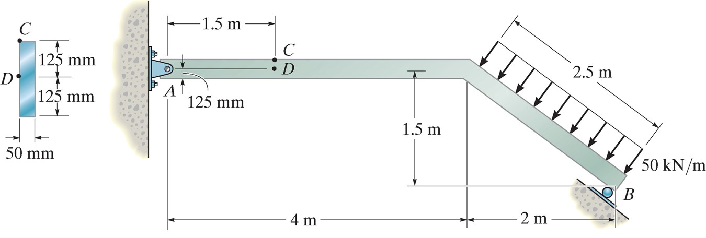
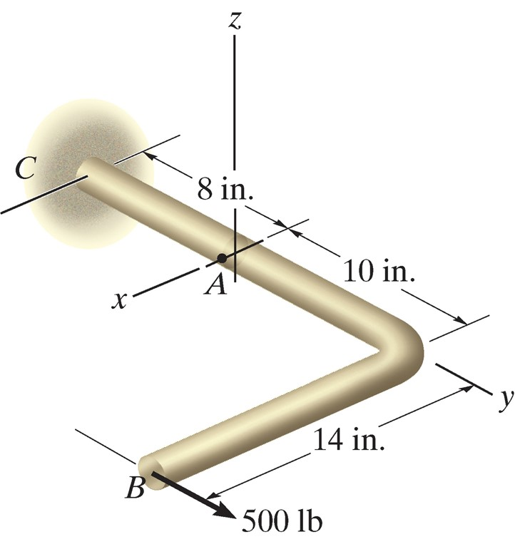
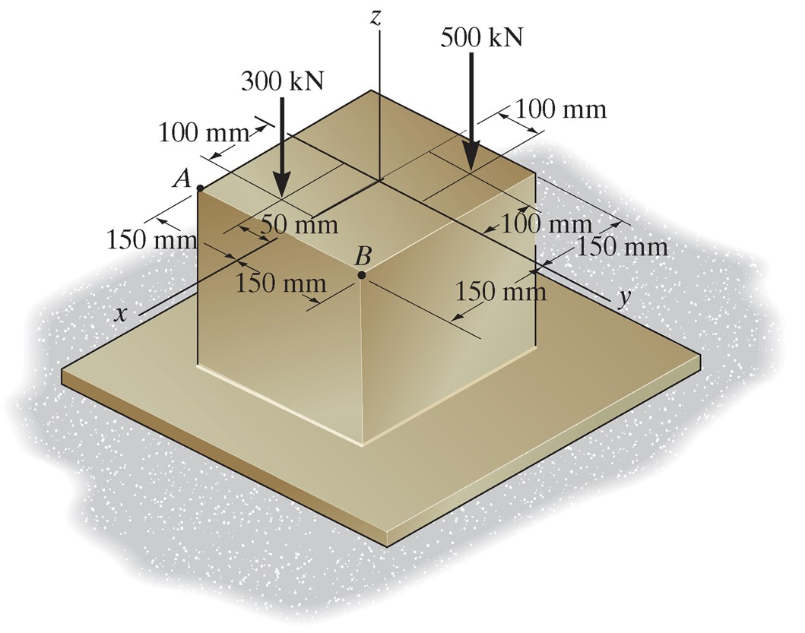
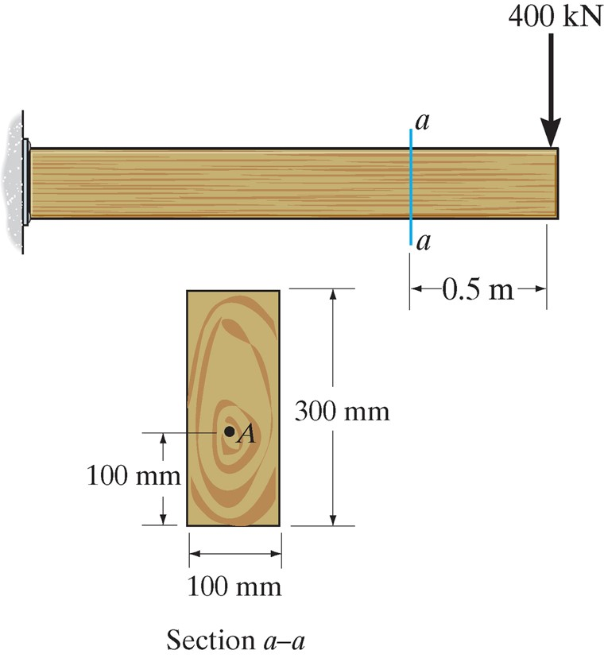

## AE333
## Mechanics of Materials
Lecture 21 - Combined loading 
Dr. Nicholas Smith 
Wichita State University, Department of Aerospace Engineering

8 April, 2020

----

## schedule

- 8 Apr - Combined Loading
- 10 Apr - Stress Transformation
- 13 Apr - Stress Transformation, HW7 Due
- 15 Apr - Strain Transformation

----
## outline

---
<!-- vim-markdown-toc GFM -->

* combined loading
* group problems
* plane stress transformation

<!-- vim-markdown-toc -->
# combined loading

----
## combined loading

-   We can use the principle of superposition to treat various loading conditions separately and then add them together to find the total stress

----
## procedure

-   Section the member at the point of interest, internal force components should be drawn acting through the centroid of the section
-   Moment components should be calculated about the centroidal axis

----
## stress components

-   Normal stress: *σ* = *N*/*A*
-   Shear: *τ* = Q*/*It
-   Bending: *σ* = y*/*I
-   Torsion: *τ* = ρ*/*J
-   Pressure Vessels: *σ*1 = r*/*t*, *σ*2 =*r*/2*t

----
## example 8.2

 <!-- .element width="30%" -->

Neglect the weight of the member and find the stress at B and C.

----
## example 8.4

 

Determine the stress at C and D.

----
## example 8.5

 <!-- .element width="30%" -->

The rod shown has a radius of 0.75 in. Find the stress at A.

---
# group problems

----
## group one

 <!-- .element width="40%" -->

Find the stress at the corners A and B for the column shown.

----
## group two

 <!-- .element width="30%" -->

Find the stress at point A for the cantilever beam shown.

----
## group three

 <!-- .element width="30%" -->

Find the load P that will cause a maximum normal stress of &sigma;=30 ksi along the section a-a.

---
# plane stress transformation

----
## plane stress

-   In general, the state of stress at a point is characterized by six stress components
-   In practice, this is rare, as most stresses and forces act in the same plane
-   This case is referred to as plane stress

----
## transformation

----
## procedure

-   If the state of stress (*σ**x*, *σ**y*, *τ**xy*) is known for a known axis system *x* and *y*, we can find the stress relative to some rotated coordinate system
-   We do this by considering a section of the element perpendicular to the *x*′ axis
-   Sum of forces in *x* and *y* will give *σ**x*′ and *τ**x*′*y*′
-   A second section is needed to find *σ**y*′, perpendicular to the *y*′ axis

----
## procedure

----
## example 9.1

 <!-- .element width="50%" -->

Represent the state of stress shown on the fuselage section on an element rotated 30&deg; clockwise from the position shown.
