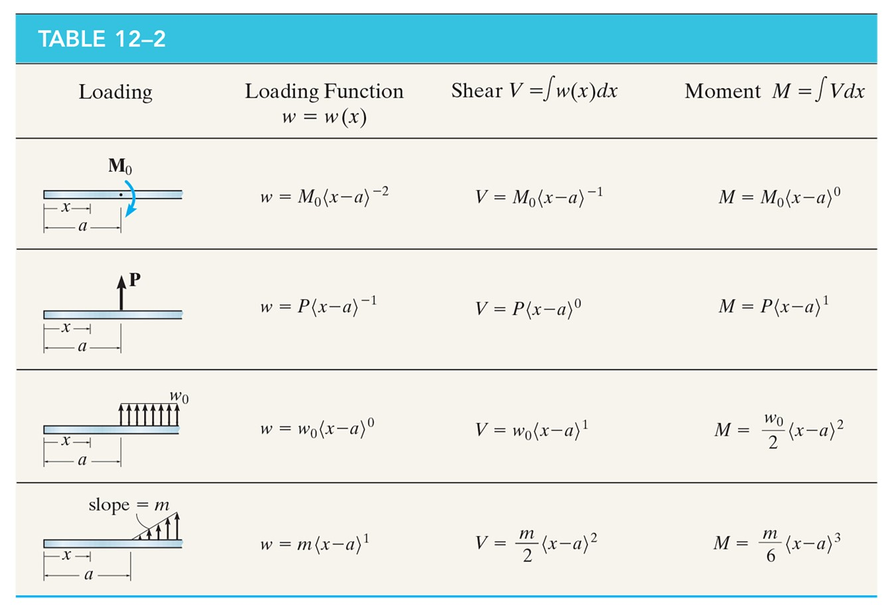
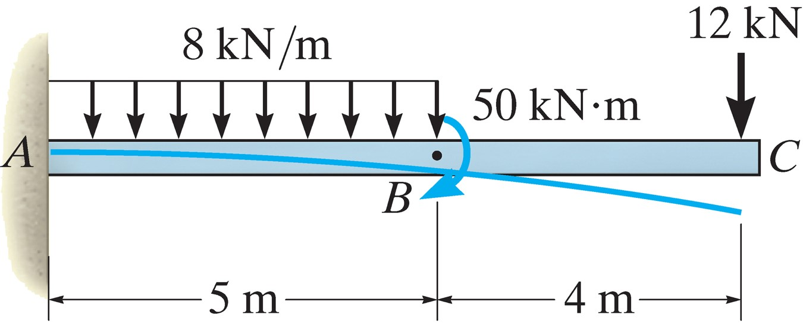
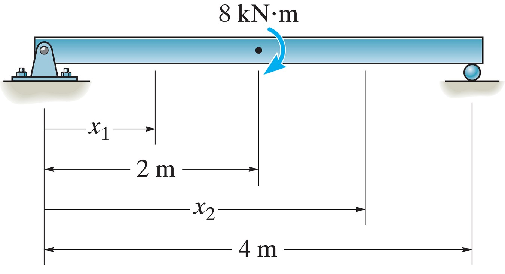
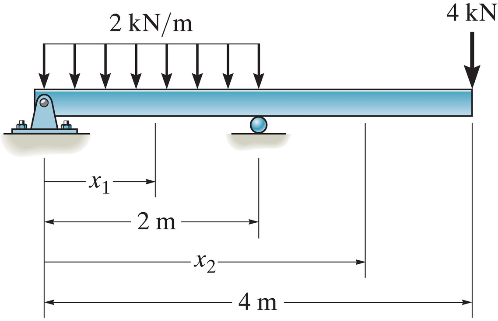
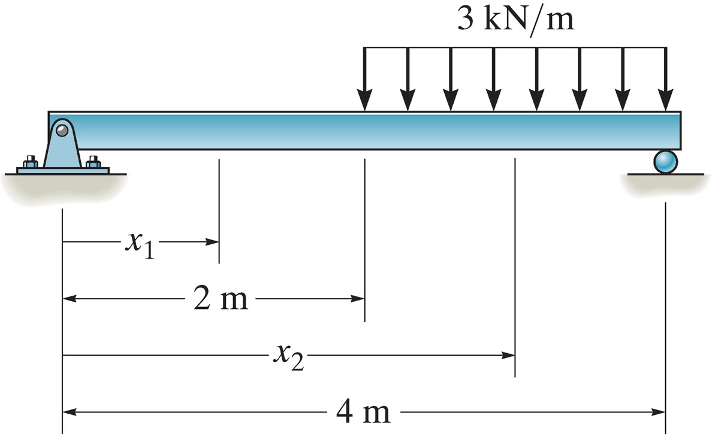

## AE333
## Mechanics of Materials
Lecture 19 - Discontinuity Functions 
Dr. Nicholas Smith 
Wichita State University, Department of Aerospace Engineering

10 November, 2021

----
## schedule

- 10 Nov - Beam Deflection (discontinuity functions)
- 12 Nov - HW 8 Due, HW 7 Self-grade Due
- 15 Nov - Beam Deflection (superposition)
- 17 Nov - Statically Indeterminate Beams
- 19 Nov - HW 9 Due, HW 8 Self-grade Due

----
## outline

<!-- vim-markdown-toc GFM -->

* discontinuity functions
* group problems

<!-- vim-markdown-toc -->

---
# discontinuity functions

----
## discontinuity functions

-   Direct integration can be very cumbersome if multiple loads or boundary conditions are applied
-   Instead of using a piecewise function, we can use discontinuity functions

----
## Macaulay functions

-   Macaulay functions can be used to describe various loading conditions, the general definition is

`$$\langle x-a\rangle^n = \begin{cases}
  0 & \text{for } x < a\\
  (x-a)^n & \text{for } x \ge a
\end{cases}
n \ge 0$$`

----
## singularity functions

-   Singularity functions are used for concentrated forces and can be written
    
`$$w = P\langle x-a\rangle^{-1} = \begin{cases}
  0 & \text{for } x\ne a\\
  P & \text{for } x=a
\end{cases}$$`

----
## discontinuity functions

 <!-- .element width="40%" -->

----
## discontinuity functions

1. We add these up for each loading case along our beam
2. We integrate as usual to find displacement from load, slope, or moment

----
## integration

- discontinuity functions follow special rules for integration
- when `$n \ge 0$`, they integrate like a normal polynomial
- when `$n < 0$`, they instead follow 
`$$ \int \langle x-a \rangle ^n dx = \langle x - a \rangle ^{n+1} $$`

----
## signs

- we need to be careful to match the sign convention
- loads are defined as positive when they act upward
- moments are defined as positive when they act clockwise

----
## example 12.5

 

---
# group problems

----
## group one

 <!-- .element width="50%" -->

Find the maximum deflection using either direct integration or discontinuity functions.

----
## group two

 <!-- .element width="50%" -->

Find the maximum deflection using either direct integration or discontinuity functions.

----
## group three

 <!-- .element width="50%" -->

Find the maximum deflection using either direct integration or discontinuity functions.

