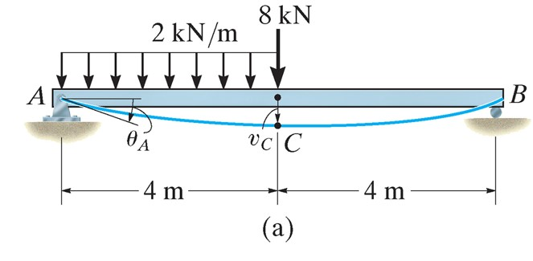
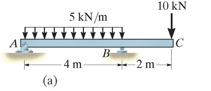
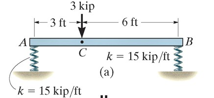

## AE333
## Mechanics of Materials
Lecture 20 - Superposition 
Dr. Nicholas Smith 
Wichita State University, Department of Aerospace Engineering

26 April, 2021

----
## schedule

- 26 April - Beam Deflection (superposition), HW 7 Self-grade Due, HW 8 Due
- 28 April - Exam 3 (will only cover through strain transformation)
- 3 May - Stress concentration, buckling
- 5 May - Final exam review
- 6 May - Project 3 Due
- Homeworks 9-11 (posted to blackboard) are optional and provide some practice for exam

----
## outline

<!-- vim-markdown-toc GFM -->

* superposition

<!-- vim-markdown-toc -->

---
# superposition

----
## superposition

-   The differential equation `$EI \frac{d^4v}{dx^4} = w(x) $` satisfies the requirements for superposition
-   `$w(x)$` is linearly related to `$v(x)$`
-   Load does not significantly change the shape of the beam

----
## superposition

-   This means we can superpose multiple deflection solutions from simpler cases
-   Appendix C in the text has many solutions that can be superposed

----
## example 12.13

Use superposition to find the displacement at C and the slope at A

----
## example 12.15

Use superposition to find the displacement at C

----
## example 12.16

The steel bar is supported by springs with k=15 kip/ft originally unstretched. For the force shown, determine the displacement at C. Take $E_{st}=29$ Msi and $I=12\text{ in}^4$.
