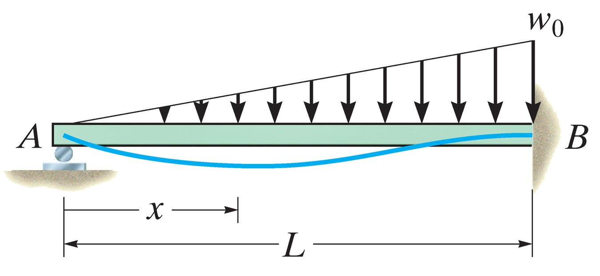
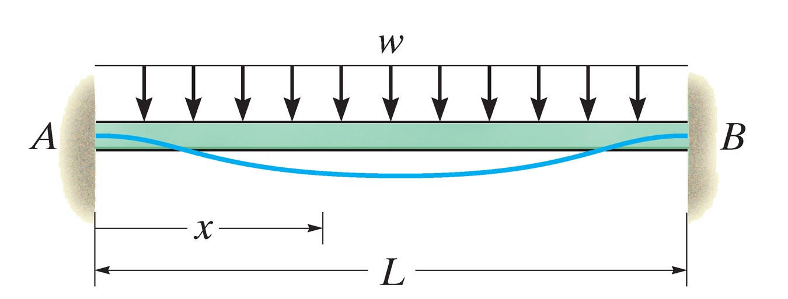
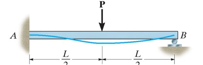
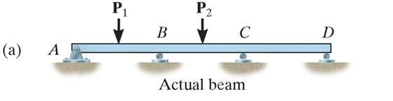
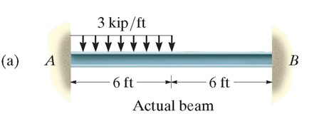
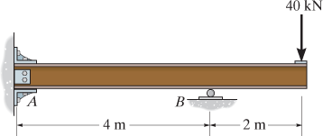
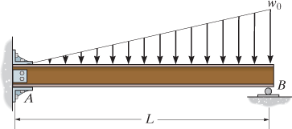
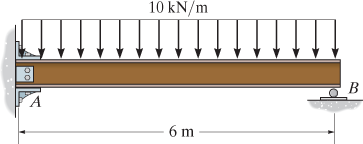

## AE333
## Mechanics of Materials
Lecture 29 - Statically Indeterminate Beams 
Dr. Nicholas Smith 
Wichita State University, Department of Aerospace Engineering

27 Apr, 2020 

----

## schedule

- 27 Apr - Statically Indeterminate Beams
- 29 Apr - Beam Review, Exam 3b assigned
- 1 May - Recitation, HW 10 Due
- 4 May - Stress Concentration
- 6 May - Buckling, Exam 3b Due
- 8 May - Review, HW 11 Due, Final Project Portion assigned

----
## outline

<!-- vim-markdown-toc GFM -->

* statically indeterminate beams
* indeterminate beams - superposition
* group problems

<!-- vim-markdown-toc -->

---
# statically indeterminate beams

----
## statically indeterminate

-   If we have redundant supports, we can have some difficulty finding the displacement
-   There are several approaches to solve these problems, we will consider direct integration and superposition

----
## integration

-   We can take the extra unknowns and include them in our formulation for *M*(*x*)
-   They will be solved for with the extra boundary conditions applied

----
## example 12.17

----
## example 12.18

---
# indeterminate beams - superposition

----
## superposition

-   To use superposition for finding deflection of statically indeterminate beams, we must first identify redundant reactions
-   We initially remove these, then superpose them back such that the deflection at that point is 0
-   The choice of which reaction(s) is redundant is arbitrary, we can choose whatever we are most comfortable with
-   We use Appendix C to find deflection and slope

----
## superposition

We can consider any reaction to be redundant.

----
## higher order indeterminacy

We need to treat each reaction separately to match Appendix C.

----
## example 12.22

Determine the moment at B.

---
# group problems

----
## group one

Determine the reactions at A and B (EI is constant).

----
## group two

Determine the reactions at A and B (EI is constant).

----
## group three

Determine the reactions at A and B. The support at B settles 2 mm. *E* = 200 GPa, *I* = 65.0(10-6)m 4.

