## AE333
## Mechanics of Materials
Lecture 22 - Stress Concentration 
Dr. Nicholas Smith 
Wichita State University, Department of Aerospace Engineering

29 November, 2021

----
## schedule

- 29 November - Stress concentration, buckling
- 1 December - Final exam review
- 3 December - Project 3 Due
- Homeworks 9-11 (posted to blackboard) are not graded, provide some practice for final exam
- 6 December - 11:00 - 12:50

----
## outline

* stress concentration factors
* buckling

---
# stress concentration factors

----
## stress concentration

-   Our textbook splits the idea of concentration factors across multiple chapters
-   4.7, 5.8, 6.9
-   The basic idea of a stress concentration factor is that some geometry causes the maximum stress to be greater than the ’nominal’ stress

----
## stress concentration

-   Stress concentrations occur when there is a sudden change in cross-sectional area
-   Features such as holes and fillets will have a stress concentration factor

`$$K = \frac{\sigma_{max}}{\sigma_{avg}}$$`

----
## stress concentration

-   The exact value of the stress concentration factor can be derived for simple shapes, but in practice it is usually looked up on a chart or figure
-   The value of *K* depends on the ratio of the radius and depth of the feature relative to the total object depth

----
## fillets

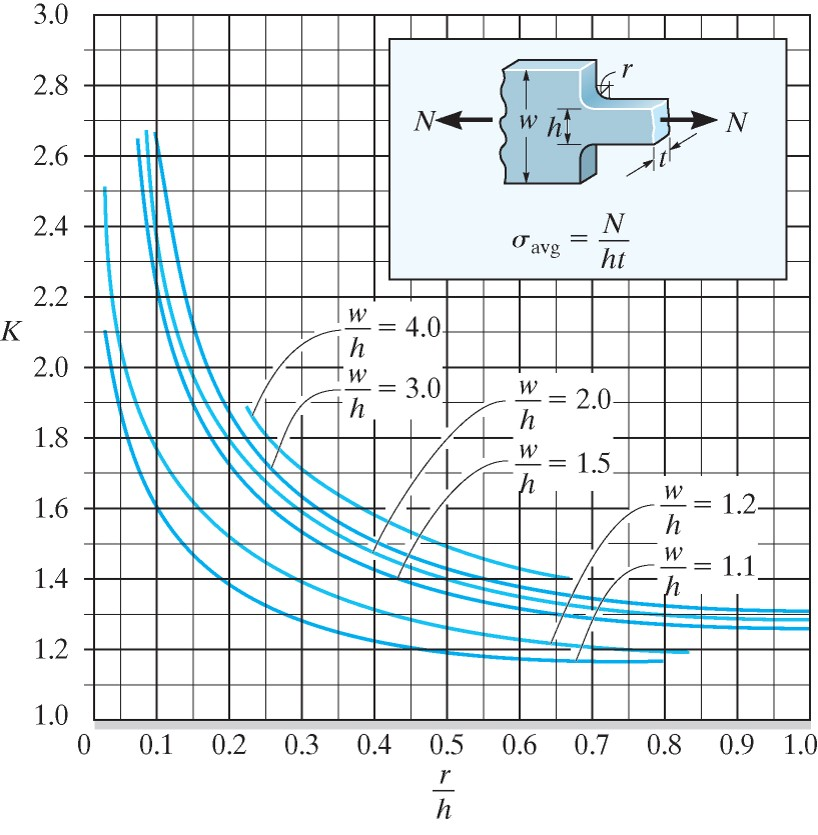 <!-- .element width="50%" -->

----
## holes

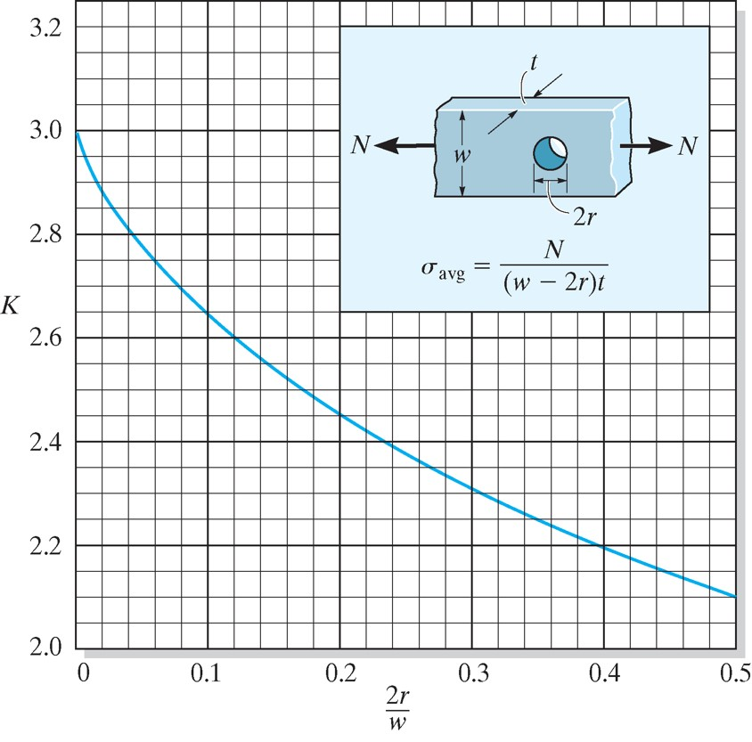 <!-- .element width="50%" -->

----
## example

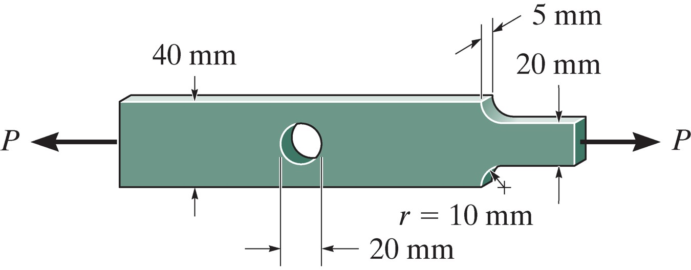   <!-- .element width="50%" -->

If `$\sigma_{allow}=120$` MPa, find the maximum axial force, P.

----
## stress concentration in torsion

-   We can also have stress concentration in torsion
-   For circular shafts, this is usually around a filleted shaft as shown in the next slide
-   The maximum shear can be found with

`$$\tau_{max} = K \frac{Tc}{J}$$`

----
## fillet

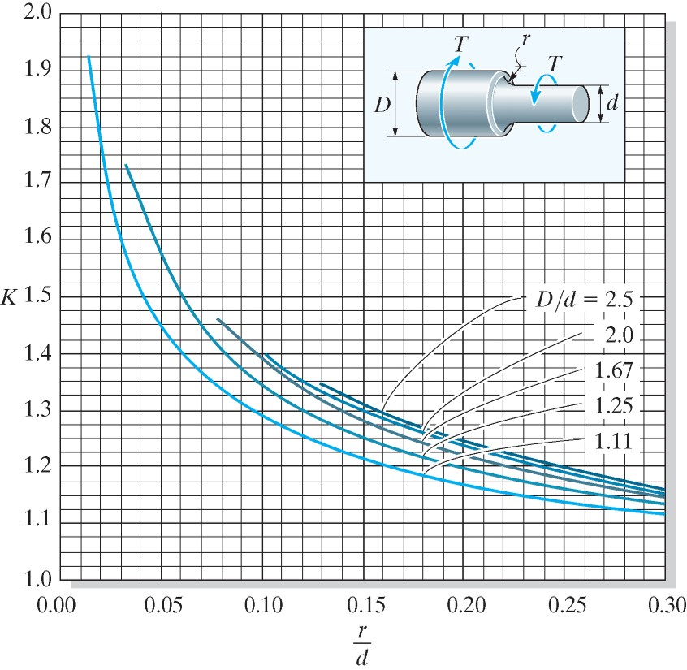 <!-- .element width="50%" -->

----
## example 5.14

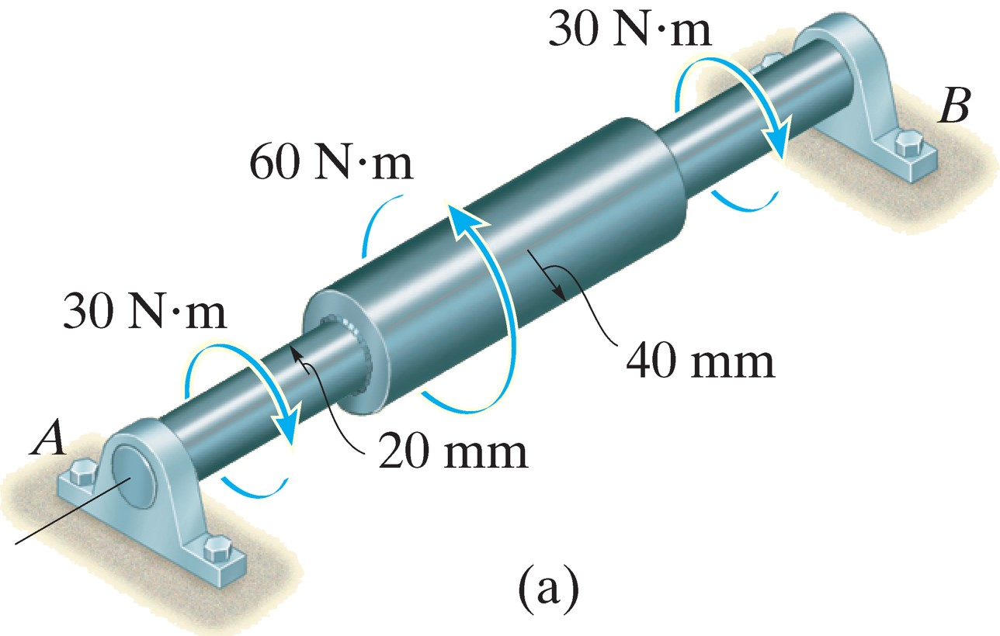 <!-- .element width="50%" -->

Determine the maximum stress in the shaft due to the applied torques. The shoulder fillet has a radius of r=6 mm

----
## beams

-   We can also have a stress concentration in a beam
-   The maximum stress can be found with

`$$\sigma_{max} = K \frac{Mc}{I}$$`

----
## fillet

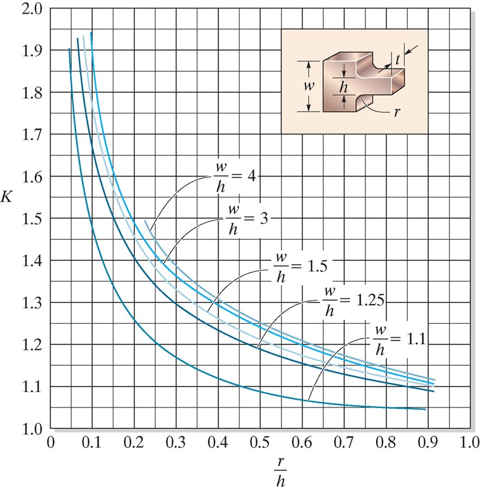 <!-- .element width="50%" -->

----
## notch

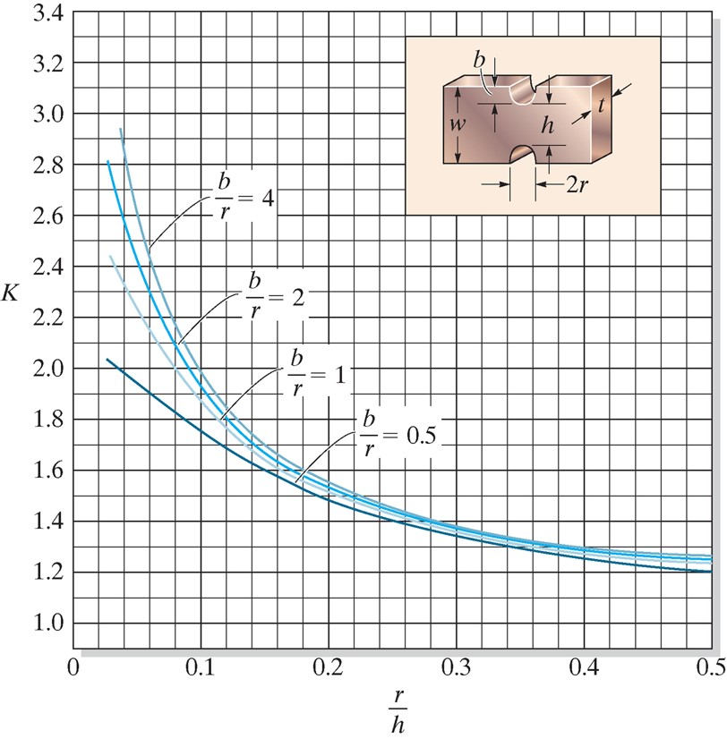 <!-- .element width="50%" -->

----
## example 6.20

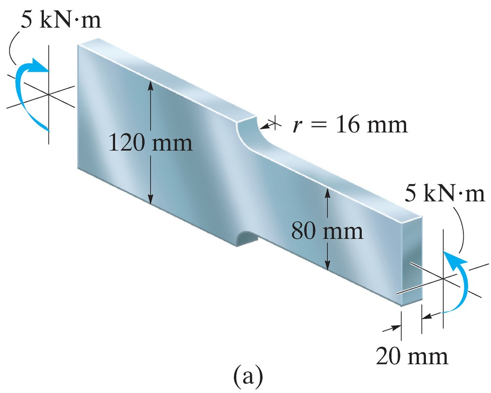 <!-- .element width="50%" -->

Determine the maximum normal stress for a steel bar with a shoulder fillet as shown.

---
# buckling

----
## stability

-   In engineering problems, stability and instability relate how an object behaves when it experiences some random perturbation
-   A stable aircraft has aerodynamic features that tend to keep it flying level, small bumps of wind that would cause it to rotate will eventually get pushed back to level
-   Some aircraft are designed to be unstable (can have a tighter turn radius), but they need to be actively controlled, as a small perturbation will cause them to spiral out of control

----
## buckling

-   For long and slender structures, stability comes into play in the form of buckling
-   A structure that is subject to buckling is generally referred to as a column
-   Buckling is usually a very sudden and drastic failure, so we need to design columns to avoid buckling

----
## critical load

-   The critical load is the maximum load a column can hold before buckling
-   We can model the critical load by considering the column as a rigid truss with a spring force acting to maintain stability
-   When the loading force overcomes the spring force, buckling occurs

----
## critical load

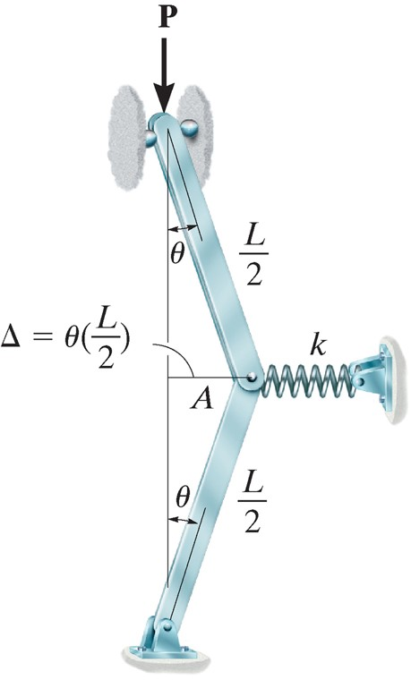 <!-- .element width="30%" -->

----
## critical load

-   The balance of forces will be

`$$ F = k\Delta = P\tan \theta $$`

-   For small `$\theta$`, we can further say that `$\Delta = \theta (L/2)$` and `$\tan \theta = \theta$`

----
## critical load

-   We find that, for stability, we need

`$$P < \frac{kL}{4}$$`

---
# ideal pin-supported column

----
## ideal column

-   Our previous analysis treated a column as a two-member truss with a spring, but we can be more precise
-   An ideal column is made of homogeneous linear elastic material and is perfectly straight before loading
-   The load is assumed to be applied through the centroid of the cross section

----
## euler-bernoulli

-   We can treat the column as a beam and use the familiar relationship

`$$EI \\frac{d^2v}{dx^2} = M$$`

----
## euler-bernoulli

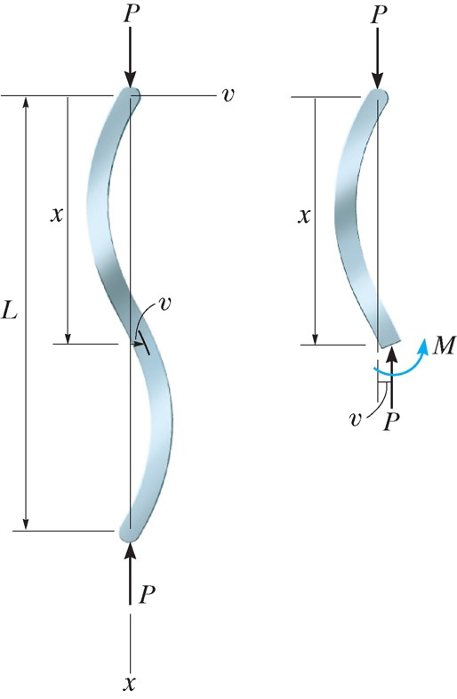 <!-- .element width="30%" -->

----
## solution

-   We see by equilibrium that *M* = -*Pv*, which gives the differential equation

`$$\begin{aligned}
  EI \frac{d^2v}{dx^2} &= -Pv \\
  \frac{d^2v}{dx^2} + \frac{P}{EI}v &= 0
\end{aligned}$$`

-   Which has the solution

`$$v = C_1 \sin \left( \sqrt{\frac{P}{EI}}x \right) + C_2 \cos \left( \sqrt{\frac{P}{EI}}x \right)$$`

----
## boundary conditions

-   We know that for `$v = 0$` at `$x = 0$`, `$C_2 = 0$`
-   We also know that `$v = 0$` at `$x = L$` which gives

`$$C_1 \sin \left( \sqrt{\frac{P}{EI}}L \right) = 0$$`

-   `$C_1 = 0$` would give the trivial solution, or we can say that

`$$\sqrt{\frac{P}{EI}}L = n \pi$$`

----
## critical load

-   The smallest value where this occurs is when `$n = 1$` and gives the critical load of

`$$P_{cr} = \frac{\pi^2 EI}{L^2}$$`

-   This is sometimes called the “Euler Load”
-   We can increase `$P_{cr}$` by decreasing *L*, increasing *E*, or increasing *I*

----
## radius of gyration

-   Sometimes we desire to find the critical stress instead of the critical load
-   We re-formulate the equation with `$I = Ar^2$` (where *r* is the radius of gyration)
-   This gives

`$$\sigma_{cr} = \frac{\pi^2 E}{(L/r)^2}$$`

-   L/r is often called the slenderness ratio

----
## example 13.1

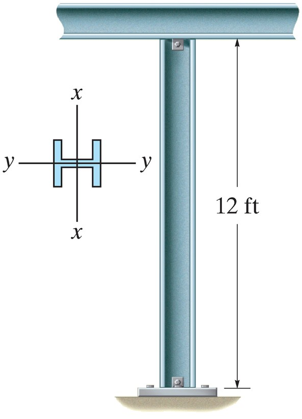 <!-- .element width="20%" -->

Find the largest axial load the A992 steel member shown can support before it buckles or yields, use `$\sigma_y = 50$` ksi.

---
# columns with other supports

----
## other supports

- we can still use Euler-Bernoulli beam theory when handling columns with other supports
- the general derivation is the same, but with different boundary conditions

----
## effective length

- One simple way to use the same formula for different supports is to modify the effective length of the column
- We can also use a length factor, *K*, to define the effective length

`$$L_e = K L$$`

----
## length factors

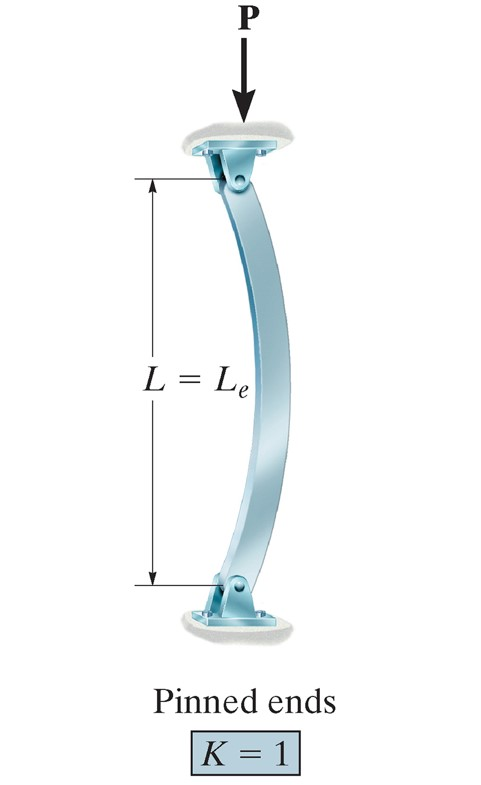 <!-- .element width="70%" -->

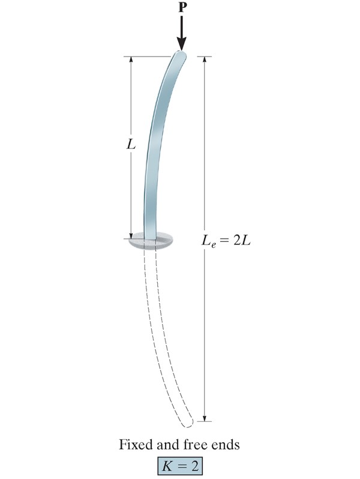 <!-- .element width="80%" -->

----
## length factors

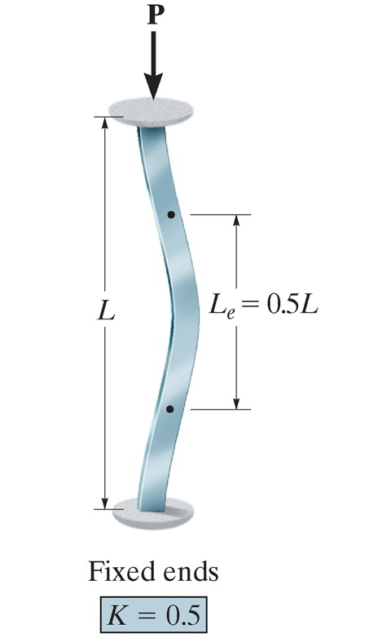 <!-- .element width="70%" -->

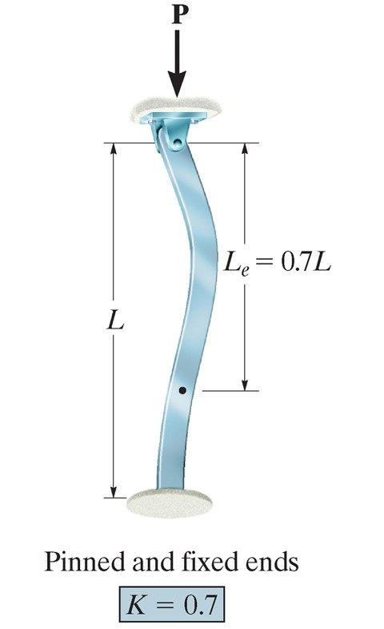 <!-- .element width="70%" -->

----
## effective length

- The formulas now become

`$$ P_{cr} = \frac{\pi^2 EI}{(KL)^2} $$`

- or 

`$$ \sigma_{cr} = \frac{\pi^2 E}{(KL/r)^2} $$`

----
## example 13.2

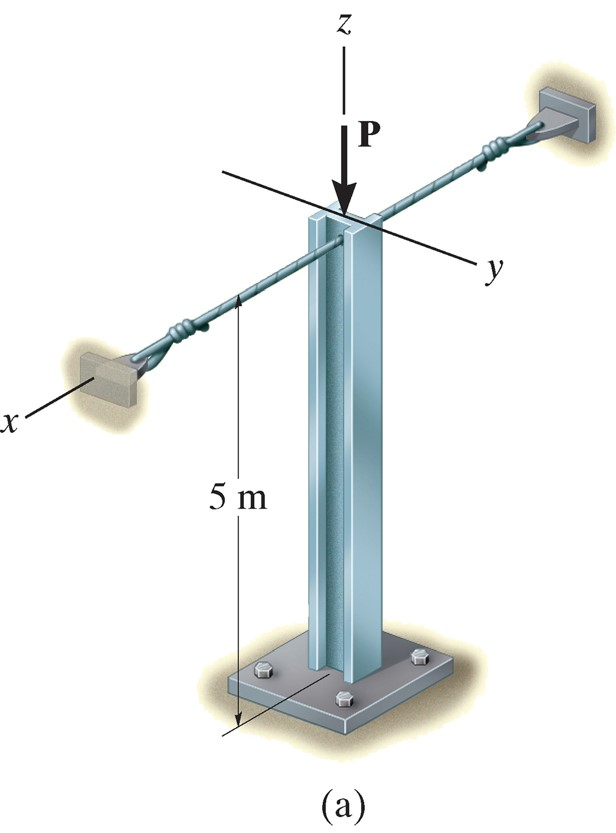 <!-- .element width="20%" -->

The column shown is braced by cables preventing movement in *x*.
Determine the largest *P* that can be applied if *E=70* GPa, $\sigma_y = 215$ MPa, *A* = 7.5 (103) m2, Ix = 61.3 (10-6) m4 and Iy = 23.2(10-6) m4.

----
## example 13.3

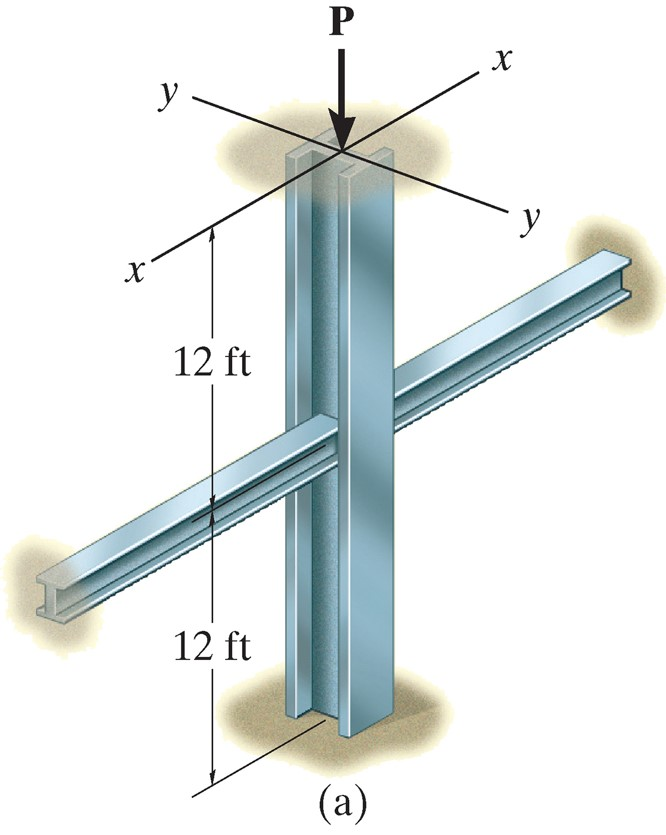 <!-- .element width="20%" -->

A W6 x 15 steel column is fixed at its ends and braced in the *y-y* axis assumed to be pinned at the midpoint.
Determine the maximum load before buckling or yield with Est = 29 Msi and `$\sigma_y = 60$` ksi.
